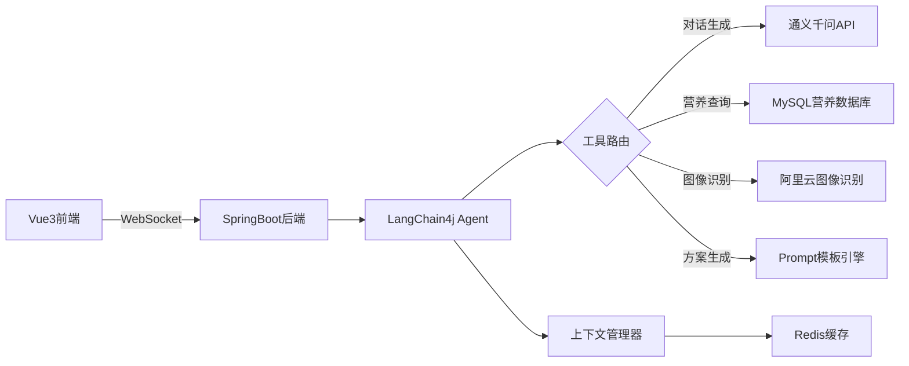
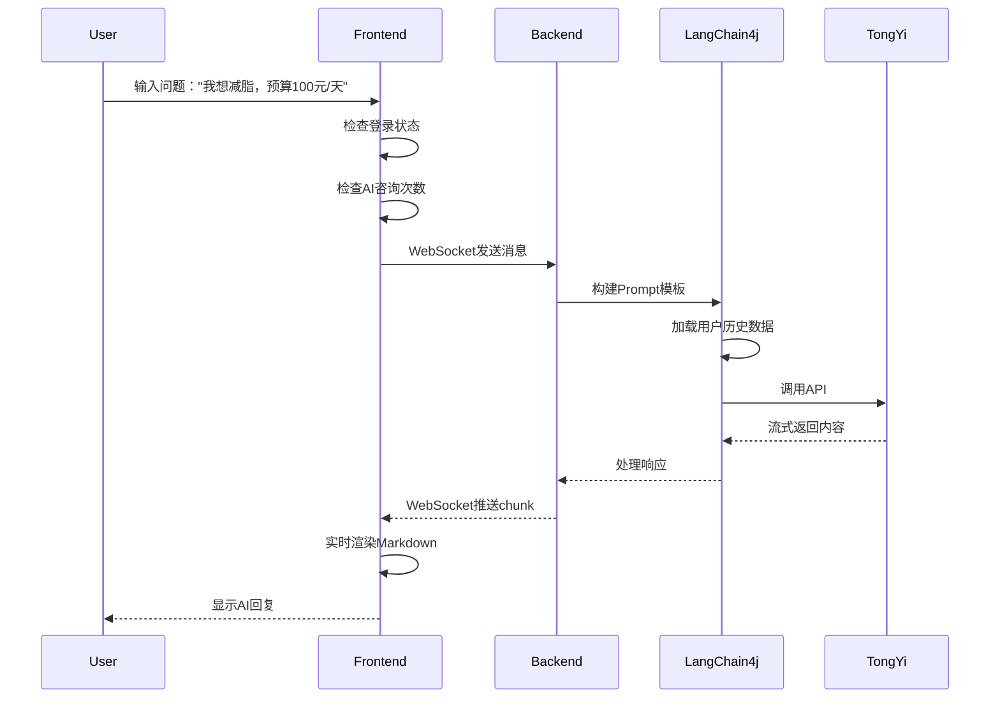

# AI健康饮食规划助手系统 - AI功能模块与后台管理

**文档版本**: 2.0  
**最后更新**: 2025年12月2日  
**说明**: 本文档是《02-功能需求详述.md》的续篇，专注于AI功能模块和后台管理系统

---

## 5. AI功能模块（核心考核点）

### 5.1 模块概述
AI功能是本系统的核心，通过集成阿里云通义千问API和LangChain4j框架，为用户提供智能饮食规划、营养咨询、食材识别等服务。

### 5.2 系统架构



### 5.3 组件结构

```
AIChatView
├── ChatInterface (对话界面)
│   ├── MessageList (消息列表)
│   │   ├── UserMessage (用户消息)
│   │   └── AIMessage (AI回复)
│   ├── InputArea (输入区域)
│   │   ├── TextInput (文本输入)
│   │   ├── FileUpload (文件上传)
│   │   └── ActionButtons (操作按钮)
│   └── QuickActions (快捷操作)
├── HistoryPanel (历史记录面板)
│   ├── SessionList (会话列表)
│   └── SessionSearch (会话搜索)
└── SettingsPanel (设置面板)
    ├── RoleSelector (角色选择)
    └── ContextSettings (上下文设置)
```

### 5.4 核心交互流程

#### 5.4.1 用户发起AI咨询

**流程图**：


#### 5.4.2 前端实现

```vue
<template>
  <div class="ai-chat-container">
    <!-- 消息列表 -->
    <div class="message-list" ref="messageListRef">
      <div 
        v-for="msg in messages" 
        :key="msg.id"
        :class="['message-item', msg.role]">
        
        <!-- 用户消息 -->
        <div v-if="msg.role === 'user'" class="user-message">
          <div class="message-content">{{ msg.content }}</div>
          
        </div>
        
        <!-- AI消息 -->
        <div v-else class="ai-message">
          
          <div class="message-content">
            <!-- Markdown渲染 -->
            <div v-html="sanitizeHTML(renderMarkdown(msg.content))"></div>
            
            <!-- 操作按钮 -->
            <div class="message-actions">
              <el-button 
                size="small" 
                @click="copyMessage(msg.content)"
                icon="DocumentCopy">
                复制
              </el-button>
              <el-button 
                v-if="userStore.isMember"
                size="small" 
                @click="exportPDF(msg.content)"
                icon="Download">
                导出PDF
              </el-button>
              <el-button 
                size="small" 
                @click="saveToFavorites(msg)"
                icon="Star">
                收藏
              </el-button>
            </div>
          </div>
        </div>
      </div>
      
      <!-- 加载动画 -->
      <div v-if="isAIThinking" class="thinking-indicator">
        
        <div class="thinking-dots">
          <span></span><span></span><span></span>
        </div>
      </div>
    </div>
    
    <!-- 输入区域 -->
    <div class="input-area">
      <!-- 快捷操作 -->
      <div class="quick-actions">
        <el-button 
          v-for="action in quickActions" 
          :key="action.id"
          size="small"
          @click="sendQuickMessage(action.template)">
          {{ action.label }}
        </el-button>
      </div>
      
      <!-- 文本输入 -->
      <div class="text-input-wrapper">
        <el-input
          v-model="currentInput"
          type="textarea"
          :rows="3"
          placeholder="请输入您的问题... (Enter发送, Shift+Enter换行)"
          @keydown.enter.exact.prevent="sendMessage"
          @keydown.enter.shift.exact="handleNewLine" />
        
        <!-- 文件上传 -->
        <input 
          ref="fileInputRef" 
          type="file" 
          hidden 
          accept=".txt,.pdf,image/*"
          @change="handleFileUpload" />
        
        <div class="input-actions">
          <el-button 
            @click="triggerFileUpload" 
            icon="Paperclip"
            circle />
          <el-button 
            type="primary" 
            @click="sendMessage"
            :loading="isSending"
            :disabled="!currentInput.trim()">
            发送
          </el-button>
        </div>
      </div>
      
      <!-- 已上传文件预览 -->
      <div v-if="uploadedFiles.length" class="uploaded-files">
        <el-tag 
          v-for="file in uploadedFiles" 
          :key="file.name"
          closable
          @close="removeFile(file)">
          {{ file.name }}
        </el-tag>
      </div>
    </div>
  </div>
</template>

<script setup>
import { ref, computed, nextTick, onMounted, onUnmounted } from 'vue'
import { marked } from 'marked'
import DOMPurify from 'dompurify'
import { ElMessage } from 'element-plus'
import { useUserStore } from '@/stores/user'
import { AIChatService } from '@/services/ai-chat'

const userStore = useUserStore()
const aiChatService = new AIChatService()

const messages = ref([])
const currentInput = ref('')
const isAIThinking = ref(false)
const isSending = ref(false)
const uploadedFiles = ref([])
const messageListRef = ref(null)
const fileInputRef = ref(null)

const userAvatar = computed(() => userStore.userInfo?.avatar || '/default-avatar.png')

const quickActions = [
  { id: 1, label: '生成减脂计划', template: '请为我生成一份减脂饮食计划' },
  { id: 2, label: '增肌饮食', template: '我想增肌，请推荐合适的饮食方案' },
  { id: 3, label: '糖尿病饮食', template: '我有糖尿病，应该如何安排饮食？' },
  { id: 4, label: '孕期营养', template: '孕期应该注意哪些营养补充？' }
]

// Markdown渲染
const renderMarkdown = (content) => {
  return marked.parse(content)
}

// XSS防护
const sanitizeHTML = (html) => {
  return DOMPurify.sanitize(html, {
    ALLOWED_TAGS: ['p', 'br', 'strong', 'em', 'ul', 'ol', 'li', 'h1', 'h2', 'h3', 'h4', 'table', 'thead', 'tbody', 'tr', 'td', 'th'],
    ALLOWED_ATTR: ['class']
  })
}

// 发送消息
const sendMessage = async () => {
  if (!currentInput.value.trim() && uploadedFiles.value.length === 0) {
    return ElMessage.warning('请输入内容或上传文件')
  }
  
  // 检查AI咨询次数
  const remaining = await userStore.checkAIQuota()
  if (remaining <= 0) {
    return ElMessage.error('今日AI咨询次数已用完，请升级会员或明日再来')
  }
  
  isSending.value = true
  
  // 添加用户消息到列表
  const userMessage = {
    id: Date.now(),
    role: 'user',
    content: currentInput.value,
    files: [...uploadedFiles.value],
    timestamp: new Date()
  }
  messages.value.push(userMessage)
  
  // 清空输入
  const messageContent = currentInput.value
  currentInput.value = ''
  uploadedFiles.value = []
  
  // 滚动到底部
  scrollToBottom()
  
  // 显示AI思考动画
  isAIThinking.value = true
  
  try {
    // 通过WebSocket发送消息
    await aiChatService.sendMessage(messageContent, userMessage.files)
    
    // 注意：实际AI回复通过WebSocket onmessage回调处理
  } catch (error) {
    ElMessage.error('发送失败，请重试')
    isAIThinking.value = false
  } finally {
    isSending.value = false
  }
}

// 处理快捷消息
const sendQuickMessage = (template) => {
  currentInput.value = template
  sendMessage()
}

// 文件上传
const triggerFileUpload = () => {
  fileInputRef.value.click()
}

const handleFileUpload = async (e) => {
  const files = Array.from(e.target.files)
  
  for (const file of files) {
    // 文件大小限制 5MB
    if (file.size > 5 * 1024 * 1024) {
      ElMessage.error(`${file.name} 超过5MB，请压缩后上传`)
      continue
    }
    
    // 文件类型检查
    const allowedTypes = ['text/plain', 'application/pdf', 'image/jpeg', 'image/png']
    if (!allowedTypes.includes(file.type)) {
      ElMessage.error(`${file.name} 格式不支持，仅支持TXT/PDF/图片`)
      continue
    }
    
    // 读取文件内容
    const fileContent = await readFileAsBase64(file)
    uploadedFiles.value.push({
      name: file.name,
      type: file.type,
      content: fileContent
    })
  }
  
  // 重置input
  e.target.value = ''
}

const readFileAsBase64 = (file) => {
  return new Promise((resolve, reject) => {
    const reader = new FileReader()
    reader.onload = (e) => resolve(e.target.result)
    reader.onerror = reject
    reader.readAsDataURL(file)
  })
}

const removeFile = (file) => {
  uploadedFiles.value = uploadedFiles.value.filter(f => f.name !== file.name)
}

// 复制消息
const copyMessage = async (content) => {
  try {
    await navigator.clipboard.writeText(content)
    ElMessage.success('已复制到剪贴板')
  } catch (error) {
    ElMessage.error('复制失败')
  }
}

// 导出PDF（仅会员功能）
const exportPDF = async (content) => {
  try {
    const res = await aiChatService.exportToPDF(content)
    // 触发下载
    const blob = new Blob([res.data], { type: 'application/pdf' })
    const url = window.URL.createObjectURL(blob)
    const a = document.createElement('a')
    a.href = url
    a.download = `饮食计划_${Date.now()}.pdf`
    a.click()
    window.URL.revokeObjectURL(url)
    ElMessage.success('导出成功')
  } catch (error) {
    ElMessage.error('导出失败')
  }
}

// 收藏到个人中心
const saveToFavorites = async (message) => {
  try {
    await userStore.saveFavorite({
      content: message.content,
      type: 'ai_response',
      timestamp: message.timestamp
    })
    ElMessage.success('已添加到收藏')
  } catch (error) {
    ElMessage.error('收藏失败')
  }
}

// 滚动到底部
const scrollToBottom = () => {
  nextTick(() => {
    if (messageListRef.value) {
      messageListRef.value.scrollTop = messageListRef.value.scrollHeight
    }
  })
}

// WebSocket消息处理
const handleAIResponse = (data) => {
  if (data.type === 'chunk') {
    // 流式输出：逐步更新最后一条AI消息
    const lastMessage = messages.value[messages.value.length - 1]
    if (lastMessage && lastMessage.role === 'assistant') {
      lastMessage.content += data.content
    } else {
      messages.value.push({
        id: data.messageId,
        role: 'assistant',
        content: data.content,
        timestamp: new Date()
      })
      isAIThinking.value = false
    }
    scrollToBottom()
  } else if (data.type === 'complete') {
    // 消息完成
    isAIThinking.value = false
    ElMessage.success('AI回复完成')
  } else if (data.type === 'error') {
    isAIThinking.value = false
    ElMessage.error(data.message || 'AI服务异常')
  }
}

// 初始化WebSocket连接
onMounted(() => {
  aiChatService.connect(userStore.userInfo.id)
  aiChatService.on('message', handleAIResponse)
  
  // 加载历史会话
  loadChatHistory()
})

onUnmounted(() => {
  aiChatService.disconnect()
})

const loadChatHistory = async () => {
  // 从后端加载最近的聊天记录
  try {
    const res = await aiChatService.getHistory()
    messages.value = res.data.messages || []
  } catch (error) {
    console.error('加载历史记录失败', error)
  }
}
</script>

<style scoped lang="scss">
.ai-chat-container {
  display: flex;
  flex-direction: column;
  height: calc(100vh - 120px);
  background: #f5f7fa;
}

.message-list {
  flex: 1;
  overflow-y: auto;
  padding: 20px;
  
  .message-item {
    margin-bottom: 24px;
    display: flex;
    
    &.user {
      justify-content: flex-end;
    }
    
    .avatar {
      width: 40px;
      height: 40px;
      border-radius: 50%;
      flex-shrink: 0;
    }
    
    .message-content {
      max-width: 70%;
      padding: 12px 16px;
      border-radius: 12px;
      background: white;
      box-shadow: 0 2px 8px rgba(0, 0, 0, 0.05);
    }
    
    &.user .message-content {
      background: #4A8EFF;
      color: white;
      margin-right: 12px;
    }
    
    &.assistant .message-content {
      margin-left: 12px;
    }
  }
  
  .message-actions {
    margin-top: 12px;
    display: flex;
    gap: 8px;
  }
}

.thinking-indicator {
  display: flex;
  align-items: center;
  
  .thinking-dots {
    margin-left: 12px;
    display: flex;
    gap: 4px;
    
    span {
      width: 8px;
      height: 8px;
      border-radius: 50%;
      background: #4A8EFF;
      animation: thinking 1.4s infinite ease-in-out both;
      
      &:nth-child(1) { animation-delay: -0.32s; }
      &:nth-child(2) { animation-delay: -0.16s; }
    }
  }
}

@keyframes thinking {
  0%, 80%, 100% { transform: scale(0); }
  40% { transform: scale(1); }
}

.input-area {
  background: white;
  padding: 16px;
  border-top: 1px solid #e0e0e0;
  
  .quick-actions {
    display: flex;
    gap: 8px;
    margin-bottom: 12px;
    flex-wrap: wrap;
  }
  
  .text-input-wrapper {
    display: flex;
    gap: 12px;
    align-items: flex-end;
  }
  
  .input-actions {
    display: flex;
    gap: 8px;
  }
  
  .uploaded-files {
    margin-top: 12px;
    display: flex;
    gap: 8px;
    flex-wrap: wrap;
  }
}
</style>
```

### 5.5 后端LangChain4j实现

#### 5.5.1 AI服务核心代码

```java
package com.nutriai.service;

import com.alibaba.dashscope.aigc.generation.Generation;
import com.alibaba.dashscope.aigc.generation.GenerationResult;
import com.alibaba.dashscope.aigc.generation.models.QwenParam;
import com.nutriai.entity.User;
import com.nutriai.entity.ChatMessage;
import com.nutriai.repository.ChatMessageRepository;
import com.nutriai.repository.UserRepository;
import dev.langchain4j.model.chat.ChatLanguageModel;
import dev.langchain4j.data.message.AiMessage;
import dev.langchain4j.data.message.UserMessage;
import dev.langchain4j.model.input.Prompt;
import dev.langchain4j.model.input.PromptTemplate;
import org.springframework.beans.factory.annotation.Autowired;
import org.springframework.stereotype.Service;

import java.util.*;
import java.util.concurrent.CompletableFuture;

@Service
public class AIDietPlanService {

    @Autowired
    private ChatMessageRepository chatMessageRepo;
    
    @Autowired
    private UserRepository userRepo;
    
    @Autowired
    private NutritionDataService nutritionService;
    
    private final Generation generation;
    
    public AIDietPlanService() {
        this.generation = new Generation();
    }
    
    /**
     * 生成饮食计划
     */
    public CompletableFuture<String> generateDietPlan(DietPlanRequest request) {
        return CompletableFuture.supplyAsync(() -> {
            try {
                // 1. 构建Prompt模板
                PromptTemplate template = PromptTemplate.from(
                    """
                    你是一位专业的注册营养师，拥有10年以上的营养咨询经验。
                    
                    用户信息：
                    - 姓名：{{userName}}
                    - 年龄：{{age}}岁
                    - 性别：{{gender}}
                    - 身高：{{height}}cm
                    - 体重：{{weight}}kg
                    - BMI：{{bmi}}
                    - 健康目标：{{healthGoal}}
                    - 每日预算：{{budget}}元
                    - 过敏源：{{allergies}}
                    - 饮食偏好：{{preferences}}
                    
                    近期饮食记录（最近7天）：
                    {{recentDietHistory}}
                    
                    任务要求：
                    1. 根据用户信息生成{{planDays}}天的详细饮食计划
                    2. 每天分为早餐、午餐、晚餐、加餐
                    3. 标注每餐的热量、蛋白质、碳水、脂肪含量
                    4. 提供采购清单和大致花费
                    5. 给出专业的营养建议
                    
                    输出格式要求：
                    - 使用Markdown格式
                    - 营养数据使用表格展示
                    - 重点内容使用加粗
                    
                    请开始生成专业的饮食计划：
                    """
                );
                
                // 2. 填充变量
                User user = userRepo.findById(request.getUserId()).orElseThrow();
                Map<String, Object> variables = new HashMap<>();
                variables.put("userName", user.getNickname());
                variables.put("age", user.getAge());
                variables.put("gender", user.getGender() == 0 ? "男" : "女");
                variables.put("height", user.getHeight());
                variables.put("weight", user.getWeight());
                variables.put("bmi", calculateBMI(user.getHeight(), user.getWeight()));
                variables.put("healthGoal", request.getHealthGoal());
                variables.put("budget", request.getBudget());
                variables.put("allergies", String.join("、", request.getAllergies()));
                variables.put("preferences", request.getPreferences());
                variables.put("planDays", request.getPlanDays());
                variables.put("recentDietHistory", getRecentDietHistory(request.getUserId()));
                
                Prompt prompt = template.apply(variables);
                
                // 3. 调用通义千问API
                QwenParam param = QwenParam.builder()
                    .model("qwen-max")
                    .prompt(prompt.text())
                    .topP(0.8)
                    .enableSearch(false)
                    .build();
                
                GenerationResult result = generation.call(param);
                String aiResponse = result.getOutput().getChoices().get(0).getMessage().getContent();
                
                // 4. 后处理：注入营养数据
                String enrichedResponse = enrichWithNutritionData(aiResponse);
                
                // 5. 保存对话记录
                saveChatMessage(request.getUserId(), prompt.text(), enrichedResponse);
                
                return enrichedResponse;
                
            } catch (Exception e) {
                throw new RuntimeException("AI服务调用失败", e);
            }
        });
    }
    
    /**
     * 计算BMI
     */
    private double calculateBMI(int height, double weight) {
        double heightInMeters = height / 100.0;
        return Math.round(weight / (heightInMeters * heightInMeters) * 10) / 10.0;
    }
    
    /**
     * 获取最近饮食记录
     */
    private String getRecentDietHistory(Long userId) {
        // 从数据库获取最近7天记录
        List<DietRecord> records = dietRecordRepo.findRecentByUserId(userId, 7);
        if (records.isEmpty()) {
            return "暂无饮食记录";
        }
        
        StringBuilder sb = new StringBuilder();
        for (DietRecord record : records) {
            sb.append(String.format("%s: %s (约%dkcal)\n", 
                record.getRecordDate(), 
                record.getFoodList(),
                record.getTotalCalories()));
        }
        return sb.toString();
    }
    
    /**
     * 丰富营养数据（从数据库查询精确值）
     */
    private String enrichWithNutritionData(String response) {
        // 使用正则提取食材名称，然后从数据库查询营养数据
        // 例如：将"鸡胸肉100g"中的"鸡胸肉"提取出来
        // 这里简化处理，实际项目需要更复杂的NLP解析
        return response; // TODO: 实现营养数据注入
    }
    
    /**
     * 保存对话记录
     */
    private void saveChatMessage(Long userId, String userMsg, String aiMsg) {
        ChatMessage message = new ChatMessage();
        message.setUserId(userId);
        message.setUserMessage(userMsg);
        message.setAiMessage(aiMsg);
        message.setCreatedAt(new Date());
        chatMessageRepo.save(message);
    }
}
```

#### 5.5.2 WebSocket实时推送

```java
package com.nutriai.websocket;

import org.springframework.stereotype.Component;
import org.springframework.web.socket.CloseStatus;
import org.springframework.web.socket.TextMessage;
import org.springframework.web.socket.WebSocketSession;
import org.springframework.web.socket.handler.TextWebSocketHandler;

import java.util.Map;
import java.util.concurrent.ConcurrentHashMap;

@Component
public class AIChatWebSocketHandler extends TextWebSocketHandler {

    // 存储用户会话
    private static final Map<Long, WebSocketSession> sessions = new ConcurrentHashMap<>();
    
    @Autowired
    private AIDietPlanService aiService;
    
    @Override
    public void afterConnectionEstablished(WebSocketSession session) throws Exception {
        // 从URL参数获取userId
        String query = session.getUri().getQuery();
        Long userId = Long.parseLong(query.split("=")[1]);
        sessions.put(userId, session);
        
        System.out.println("WebSocket连接建立：userId=" + userId);
    }
    
    @Override
    protected void handleTextMessage(WebSocketSession session, TextMessage message) throws Exception {
        // 解析消息
        JSONObject json = JSON.parseObject(message.getPayload());
        String type = json.getString("type");
        
        if ("user_message".equals(type)) {
            String content = json.getString("content");
            Long userId = getUserIdFromSession(session);
            
            // 异步调用AI服务
            aiService.generateDietPlan(buildRequest(userId, content))
                .thenAccept(response -> {
                    try {
                        // 分块发送（模拟流式输出）
                        sendStreamResponse(session, response);
                    } catch (Exception e) {
                        e.printStackTrace();
                    }
                });
        }
    }
    
    /**
     * 流式发送响应
     */
    private void sendStreamResponse(WebSocketSession session, String fullResponse) throws Exception {
        // 按字符分块发送，模拟打字效果
        int chunkSize = 10;
        for (int i = 0; i < fullResponse.length(); i += chunkSize) {
            int end = Math.min(i + chunkSize, fullResponse.length());
            String chunk = fullResponse.substring(i, end);
            
            JSONObject msg = new JSONObject();
            msg.put("type", "chunk");
            msg.put("content", chunk);
            msg.put("messageId", System.currentTimeMillis());
            
            session.sendMessage(new TextMessage(msg.toJSONString()));
            Thread.sleep(50); // 延迟50ms，模拟打字效果
        }
        
        // 发送完成信号
        JSONObject completeMsg = new JSONObject();
        completeMsg.put("type", "complete");
        session.sendMessage(new TextMessage(completeMsg.toJSONString()));
    }
    
    @Override
    public void afterConnectionClosed(WebSocketSession session, CloseStatus status) throws Exception {
        Long userId = getUserIdFromSession(session);
        sessions.remove(userId);
        System.out.println("WebSocket连接关闭：userId=" + userId);
    }
}
```

### 5.6 安全防护设计

| 风险类型 | 防护措施 | 实现位置 |
|----------|----------|----------|
| XSS攻击 | DOMPurify过滤AI返回内容 | 前端ChatInterface组件 |
| SQL注入 | MyBatis参数化查询 | 后端DAO层 |
| 敏感信息泄露 | WebSocket消息加密（TLS） | Nginx配置 |
| API滥用 | 请求频率限制(5次/分钟) | SpringBoot AOP切面 |
| 文件上传风险 | 仅允许TXT/PDF/图片+大小限制 | 前后端双重校验 |
| Prompt注入 | 内容过滤+角色限定 | LangChain4j Prompt模板 |

---

## 6. 后台管理系统

### 6.1 模块概述
为管理员提供用户管理、数据统计、AI日志监控、系统配置等功能。

### 6.2 权限控制矩阵

| 路由 | 超级管理员 | 普通管理员 | 运营人员 | 功能说明 |
|------|-----------|-----------|---------|---------|
| /admin/dashboard | ✅ | ✅ | ✅ | 数据看板 |
| /admin/users | ✅ | ✅ | ❌ | 用户管理 |
| /admin/ai-logs | ✅ | ❌ | ❌ | AI日志查看 |
| /admin/promotions | ✅ | ✅ | ✅ | 营销活动 |
| /admin/nutrition-db | ✅ | ✅ | ❌ | 营养数据库 |
| /admin/system-config | ✅ | ❌ | ❌ | 系统配置 |

### 6.3 数据看板需求

#### 6.3.1 核心指标卡片
- **今日新增用户数**（对比昨日）
- **AI咨询总次数**（对比上周同期）
- **会员转化率**（本月）
- **系统响应时间**（平均值）

#### 6.3.2 用户增长曲线（ECharts）

```vue
<template>
  <div class="dashboard-container">
    <el-row :gutter="20">
      <!-- 核心指标卡片 -->
      <el-col :span="6" v-for="metric in metrics" :key="metric.id">
        <el-card class="metric-card">
          <div class="metric-icon" :style="{ background: metric.color }">
            <i :class="metric.icon"></i>
          </div>
          <div class="metric-content">
            <div class="metric-value">{{ metric.value }}</div>
            <div class="metric-label">{{ metric.label }}</div>
            <div class="metric-trend" :class="metric.trend > 0 ? 'up' : 'down'">
              <i :class="metric.trend > 0 ? 'arrow-up' : 'arrow-down'"></i>
              {{ Math.abs(metric.trend) }}%
            </div>
          </div>
        </el-card>
      </el-col>
    </el-row>
    
    <el-row :gutter="20" style="margin-top: 20px;">
      <!-- 用户增长图表 -->
      <el-col :span="12">
        <el-card>
          <template #header>
            <div class="card-header">
              <span>用户增长趋势</span>
              <el-radio-group v-model="userChartPeriod" size="small">
                <el-radio-button label="day">日</el-radio-button>
                <el-radio-button label="week">周</el-radio-button>
                <el-radio-button label="month">月</el-radio-button>
              </el-radio-group>
            </div>
          </template>
          <div ref="userChartRef" style="width: 100%; height: 350px;"></div>
        </el-card>
      </el-col>
      
      <!-- AI咨询分布 -->
      <el-col :span="12">
        <el-card>
          <template #header>
            <span>AI咨询类型分布</span>
          </template>
          <div ref="aiTypeChartRef" style="width: 100%; height: 350px;"></div>
        </el-card>
      </el-col>
    </el-row>
    
    <el-row :gutter="20" style="margin-top: 20px;">
      <!-- 最近活动用户 -->
      <el-col :span="24">
        <el-card>
          <template #header>
            <span>最近活动用户</span>
          </template>
          <el-table :data="recentUsers" stripe>
            <el-table-column prop="username" label="用户名" />
            <el-table-column prop="memberLevel" label="会员等级">
              <template #default="{ row }">
                <el-tag :type="getMemberTagType(row.memberLevel)">
                  {{ row.memberLevel }}
                </el-tag>
              </template>
            </el-table-column>
            <el-table-column prop="lastLogin" label="最后登录" />
            <el-table-column prop="aiUsageToday" label="今日AI使用" />
            <el-table-column label="操作">
              <template #default="{ row }">
                <el-button size="small" @click="viewUserDetail(row)">详情</el-button>
              </template>
            </el-table-column>
          </el-table>
        </el-card>
      </el-col>
    </el-row>
  </div>
</template>

<script setup>
import { ref, onMounted, onUnmounted, watch } from 'vue'
import * as echarts from 'echarts'
import api from '@/services/api'

const metrics = ref([
  { id: 1, label: '今日新增用户', value: 0, trend: 0, icon: 'user-plus', color: '#4A8EFF' },
  { id: 2, label: 'AI咨询次数', value: 0, trend: 0, icon: 'chat', color: '#67C23A' },
  { id: 3, label: '会员转化率', value: '0%', trend: 0, icon: 'crown', color: '#E6A23C' },
  { id: 4, label: '平均响应时间', value: '0ms', trend: 0, icon: 'clock', color: '#F56C6C' }
])

const userChartRef = ref(null)
const aiTypeChartRef = ref(null)
const userChartPeriod = ref('week')
const recentUsers = ref([])

let userChart = null
let aiTypeChart = null
let wsConnection = null

// 初始化用户增长图表
const initUserChart = (data) => {
  if (!userChart) {
    userChart = echarts.init(userChartRef.value)
  }
  
  const option = {
    tooltip: {
      trigger: 'axis',
      axisPointer: { type: 'cross' }
    },
    legend: {
      data: ['新增用户', '活跃用户']
    },
    xAxis: {
      type: 'category',
      data: data.dates
    },
    yAxis: {
      type: 'value',
      name: '用户数'
    },
    series: [
      {
        name: '新增用户',
        type: 'line',
        smooth: true,
        data: data.newUsers,
        areaStyle: {
          color: new echarts.graphic.LinearGradient(0, 0, 0, 1, [
            { offset: 0, color: 'rgba(74, 142, 255, 0.3)' },
            { offset: 1, color: 'rgba(74, 142, 255, 0.05)' }
          ])
        }
      },
      {
        name: '活跃用户',
        type: 'line',
        smooth: true,
        data: data.activeUsers,
        areaStyle: {
          color: new echarts.graphic.LinearGradient(0, 0, 0, 1, [
            { offset: 0, color: 'rgba(103, 194, 58, 0.3)' },
            { offset: 1, color: 'rgba(103, 194, 58, 0.05)' }
          ])
        }
      }
    ]
  }
  
  userChart.setOption(option)
}

// 初始化AI类型分布饼图
const initAITypeChart = (data) => {
  if (!aiTypeChart) {
    aiTypeChart = echarts.init(aiTypeChartRef.value)
  }
  
  const option = {
    tooltip: {
      trigger: 'item',
      formatter: '{a} <br/>{b}: {c} ({d}%)'
    },
    legend: {
      orient: 'vertical',
      left: 'left'
    },
    series: [
      {
        name: 'AI咨询类型',
        type: 'pie',
        radius: ['40%', '70%'],
        avoidLabelOverlap: false,
        itemStyle: {
          borderRadius: 10,
          borderColor: '#fff',
          borderWidth: 2
        },
        label: {
          show: false,
          position: 'center'
        },
        emphasis: {
          label: {
            show: true,
            fontSize: 20,
            fontWeight: 'bold'
          }
        },
        data: data
      }
    ]
  }
  
  aiTypeChart.setOption(option)
}

// 获取数据
const fetchDashboardData = async () => {
  try {
    const res = await api.get('/admin/dashboard/metrics')
    
    // 更新核心指标
    metrics.value[0].value = res.data.newUsersToday
    metrics.value[0].trend = res.data.newUsersTrend
    metrics.value[1].value = res.data.aiConsultations
    metrics.value[1].trend = res.data.aiConsultationsTrend
    metrics.value[2].value = res.data.conversionRate + '%'
    metrics.value[2].trend = res.data.conversionRateTrend
    metrics.value[3].value = res.data.avgResponseTime + 'ms'
    metrics.value[3].trend = res.data.avgResponseTimeTrend
    
    // 更新图表
    initUserChart(res.data.userGrowthData)
    initAITypeChart(res.data.aiTypeDistribution)
    
    // 更新最近活动用户
    recentUsers.value = res.data.recentUsers
    
  } catch (error) {
    console.error('获取数据失败', error)
  }
}

// WebSocket实时更新
const connectWebSocket = () => {
  wsConnection = new WebSocket('wss://api.nutriai.com/admin/metrics')
  
  wsConnection.onmessage = (event) => {
    const data = JSON.parse(event.data)
    
    if (data.type === 'metrics_update') {
      // 实时更新指标
      fetchDashboardData()
    } else if (data.type === 'alert') {
      // 异常告警
      ElNotification({
        title: '系统告警',
        message: data.message,
        type: 'warning',
        duration: 0
      })
    }
  }
  
  wsConnection.onerror = () => {
    console.error('WebSocket连接失败，5秒后重试...')
    setTimeout(connectWebSocket, 5000)
  }
}

const getMemberTagType = (level) => {
  const types = {
    '普通会员': 'info',
    '白银会员': '',
    '黄金会员': 'warning'
  }
  return types[level] || 'info'
}

onMounted(() => {
  fetchDashboardData()
  connectWebSocket()
  
  // 监听窗口大小变化
  window.addEventListener('resize', () => {
    userChart?.resize()
    aiTypeChart?.resize()
  })
})

onUnmounted(() => {
  userChart?.dispose()
  aiTypeChart?.dispose()
  wsConnection?.close()
})

watch(userChartPeriod, () => {
  fetchDashboardData()
})
</script>

<style scoped lang="scss">
.dashboard-container {
  padding: 20px;
}

.metric-card {
  display: flex;
  align-items: center;
  
  .metric-icon {
    width: 60px;
    height: 60px;
    border-radius: 12px;
    display: flex;
    align-items: center;
    justify-content: center;
    font-size: 28px;
    color: white;
  }
  
  .metric-content {
    flex: 1;
    margin-left: 16px;
    
    .metric-value {
      font-size: 28px;
      font-weight: bold;
      color: #333;
    }
    
    .metric-label {
      font-size: 14px;
      color: #666;
      margin-top: 4px;
    }
    
    .metric-trend {
      font-size: 12px;
      margin-top: 8px;
      
      &.up { color: #67C23A; }
      &.down { color: #F56C6C; }
    }
  }
}
</style>
```

### 6.4 路由懒加载与权限控制

```javascript
// router/admin.js
export const adminRoutes = [
  {
    path: '/admin',
    component: () => import('@/layouts/AdminLayout.vue'),
    meta: { requiresAuth: true, role: 'admin' },
    children: [
      {
        path: 'dashboard',
        name: 'AdminDashboard',
        component: () => import('@/views/admin/Dashboard.vue'),
        meta: { title: '数据看板', role: 'operator' }
      },
      {
        path: 'users',
        name: 'UserManagement',
        component: () => import('@/views/admin/UserManagement.vue'),
        meta: { title: '用户管理', role: 'admin' }
      },
      {
        path: 'ai-logs',
        name: 'AILogs',
        component: () => import('@/views/admin/AILogs.vue'),
        meta: { title: 'AI日志', role: 'super_admin' }
      },
      {
        path: 'system-config',
        name: 'SystemConfig',
        component: () => import('@/views/admin/SystemConfig.vue'),
        meta: { title: '系统配置', role: 'super_admin' }
      }
    ]
  }
]

// 路由守卫
router.beforeEach((to, from, next) => {
  const authStore = useAuthStore()
  const requiredRole = to.meta.role
  
  if (to.meta.requiresAuth && !authStore.isLoggedIn) {
    next('/login')
  } else if (requiredRole && !authStore.hasRole(requiredRole)) {
    ElMessage.error('权限不足')
    next(false)
  } else {
    next()
  }
})
```

---

## 7. 总结

本文档详细描述了AI功能模块和后台管理系统的全部需求，包括：

### 7.1 AI功能模块
- ✅ 完整的聊天界面设计
- ✅ WebSocket实时通信
- ✅ Markdown渲染与XSS防护
- ✅ 文件上传与AI识别
- ✅ LangChain4j后端集成
- ✅ 流式输出用户体验
- ✅ PDF导出功能

### 7.2 后台管理系统
- ✅ 多角色权限控制
- ✅ 实时数据看板
- ✅ ECharts数据可视化
- ✅ WebSocket实时告警
- ✅ 用户管理功能
- ✅ AI日志监控

### 7.3 下一步工作
请参考以下文档继续开发：
- **03-前端开发规范.md** - Vue3组件规范、评分标准
- **04-技术架构设计.md** - 系统架构、部署方案
- **05-数据库设计.md** - 表结构、ER图
- **06-接口文档.md** - API规范
- **07-项目开发计划.md** - 迭代计划、任务分解
