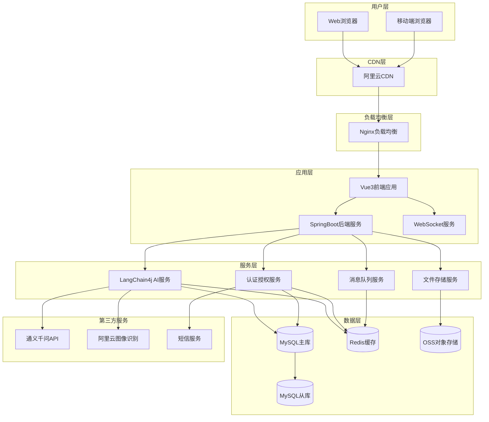
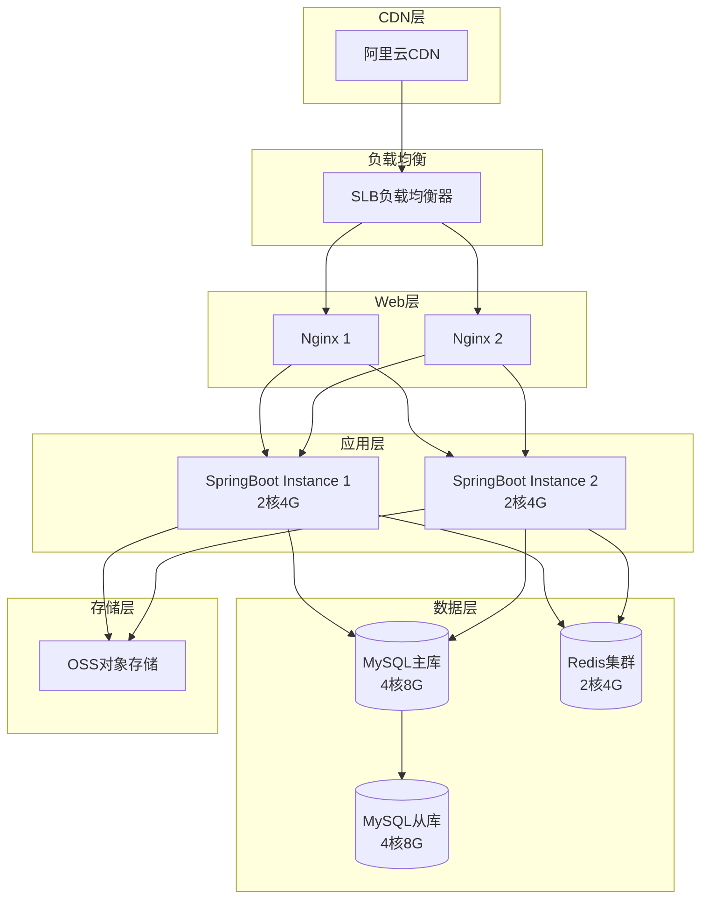
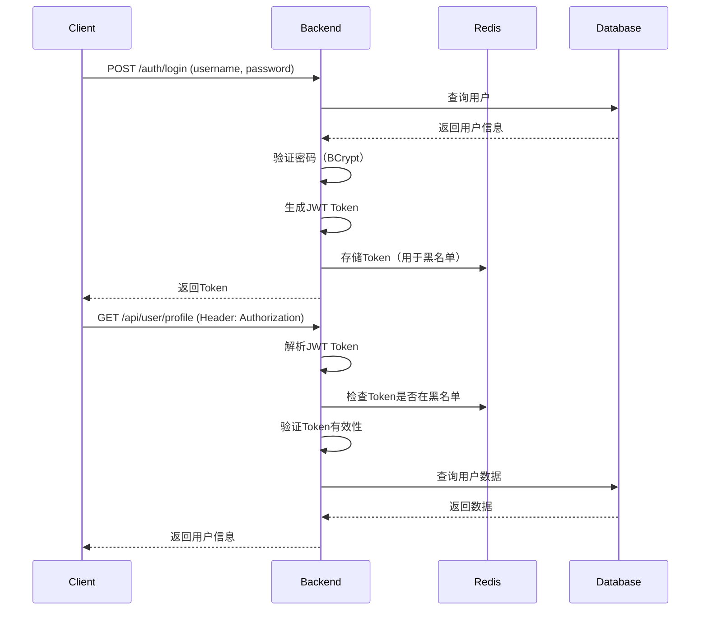

# AI健康饮食规划助手系统 - 技术架构设计

**文档版本**: 2.0  
**最后更新**: 2025年12月2日

---

## 目录
1. [系统架构概览](#1-系统架构概览)
2. [前端架构设计](#2-前端架构设计)
3. [后端架构设计](#3-后端架构设计)
4. [AI服务架构](#4-ai服务架构)
5. [数据架构设计](#5-数据架构设计)
6. [部署架构](#6-部署架构)
7. [安全架构](#7-安全架构)
8. [性能优化方案](#8-性能优化方案)

---

## 1. 系统架构概览

### 1.1 整体架构图



### 1.2 技术栈总览

| 层次 | 技术选型 | 版本 | 选型理由 |
|------|---------|------|----------|
| **前端框架** | Vue 3 | 3.3.4 | Composition API、更好的TypeScript支持 |
| **状态管理** | Pinia | 2.1.6 | Vue官方推荐，更轻量 |
| **路由管理** | Vue Router | 4.2.4 | Vue生态官方路由 |
| **UI组件库** | Element Plus | 2.3.12 | 企业级组件库，中文友好 |
| **CSS框架** | TailwindCSS | 3.3.3 | 原子化CSS，开发效率高 |
| **HTTP客户端** | Axios | 1.5.0 | 功能强大，拦截器支持 |
| **图表库** | ECharts | 5.4.3 | 功能丰富，性能优秀 |
| **后端框架** | Spring Boot | 3.2.0 | 企业级Java框架 |
| **AI框架** | LangChain4j | 0.25.0 | Java版LangChain |
| **数据库** | MySQL | 8.0 | 成熟稳定，社区活跃 |
| **缓存** | Redis | 6.0 | 高性能KV存储 |
| **消息队列** | RabbitMQ | 3.12 | 异步任务处理 |
| **对象存储** | 阿里云OSS | - | 静态资源存储 |
| **AI服务** | 通义千问 | qwen-max | 阿里云大模型 |

### 1.3 架构特点

#### 1.3.1 前后端分离
- **前端**：Vue3 SPA，部署到OSS+CDN
- **后端**：SpringBoot RESTful API + WebSocket
- **优势**：独立开发、独立部署、独立扩展

#### 1.3.2 微服务化（轻量级）
虽然是单体应用，但采用模块化设计：
- 认证模块（Auth Module）
- 用户模块（User Module）
- AI服务模块（AI Module）
- 后台管理模块（Admin Module）

#### 1.3.3 分层架构
```
Presentation Layer（表现层）
    ↓
Business Logic Layer（业务逻辑层）
    ↓
Data Access Layer（数据访问层）
    ↓
Database Layer（数据库层）
```

---

## 2. 前端架构设计

### 2.1 项目目录结构

```
nutriai-frontend/
├── public/
│   ├── favicon.ico
│   └── index.html
├── src/
│   ├── assets/              # 静态资源
│   │   ├── images/
│   │   ├── icons/
│   │   └── fonts/
│   ├── components/          # 组件
│   │   ├── base/           # 基础组件
│   │   │   ├── BaseButton.vue
│   │   │   ├── BaseInput.vue
│   │   │   └── NutritionCard.vue
│   │   ├── layout/         # 布局组件
│   │   │   ├── HeaderNav.vue
│   │   │   ├── Sidebar.vue
│   │   │   └── FooterInfo.vue
│   │   ├── home/           # 首页组件
│   │   │   ├── BannerSlider.vue
│   │   │   └── FeatureCards.vue
│   │   ├── user/           # 用户中心组件
│   │   │   ├── HealthProfile.vue
│   │   │   ├── DietRecords.vue
│   │   │   └── FavoritePlans.vue
│   │   ├── ai/             # AI功能组件
│   │   │   ├── ChatInterface.vue
│   │   │   ├── MessageList.vue
│   │   │   └── InputArea.vue
│   │   └── admin/          # 后台组件
│   │       ├── Dashboard.vue
│   │       └── UserTable.vue
│   ├── composables/         # 组合式函数
│   │   ├── useDebounce.js
│   │   ├── useWebSocket.js
│   │   └── useAuth.js
│   ├── directives/          # 自定义指令
│   │   ├── loading.js
│   │   └── permission.js
│   ├── layouts/             # 页面布局
│   │   ├── DefaultLayout.vue
│   │   ├── UserLayout.vue
│   │   └── AdminLayout.vue
│   ├── router/              # 路由配置
│   │   ├── index.js
│   │   ├── routes/
│   │   │   ├── home.js
│   │   │   ├── user.js
│   │   │   └── admin.js
│   │   └── guards/
│   │       ├── auth.js
│   │       └── permission.js
│   ├── services/            # API服务
│   │   ├── api.js          # Axios实例
│   │   ├── auth.js         # 认证API
│   │   ├── user.js         # 用户API
│   │   ├── ai.js           # AI API
│   │   └── admin.js        # 后台API
│   ├── stores/              # Pinia状态管理
│   │   ├── index.js
│   │   ├── auth.js
│   │   ├── user.js
│   │   ├── theme.js
│   │   └── ai-chat.js
│   ├── styles/              # 样式文件
│   │   ├── main.scss
│   │   ├── variables.scss
│   │   ├── mixins.scss
│   │   ├── theme.scss
│   │   └── utilities.scss
│   ├── utils/               # 工具函数
│   │   ├── format.js       # 格式化工具
│   │   ├── validate.js     # 验证工具
│   │   └── storage.js      # 存储工具
│   ├── views/               # 页面组件
│   │   ├── HomeView.vue
│   │   ├── auth/
│   │   │   ├── LoginView.vue
│   │   │   └── RegisterView.vue
│   │   ├── user/
│   │   │   ├── ProfileView.vue
│   │   │   ├── DietRecordsView.vue
│   │   │   └── FavoritesView.vue
│   │   ├── ai/
│   │   │   └── ChatView.vue
│   │   ├── admin/
│   │   │   ├── DashboardView.vue
│   │   │   └── UserManagementView.vue
│   │   └── error/
│   │       ├── NotFoundView.vue
│   │       └── ServerErrorView.vue
│   ├── App.vue              # 根组件
│   └── main.js              # 入口文件
├── .env                     # 环境变量
├── .env.development         # 开发环境变量
├── .env.production          # 生产环境变量
├── .eslintrc.js             # ESLint配置
├── .prettierrc              # Prettier配置
├── vite.config.js           # Vite配置
├── tailwind.config.js       # TailwindCSS配置
├── package.json
└── README.md
```

### 2.2 核心配置文件

#### 2.2.1 Vite配置

```javascript
// vite.config.js
import { defineConfig } from 'vite'
import vue from '@vitejs/plugin-vue'
import path from 'path'
import AutoImport from 'unplugin-auto-import/vite'
import Components from 'unplugin-vue-components/vite'
import { ElementPlusResolver } from 'unplugin-vue-components/resolvers'

export default defineConfig({
  plugins: [
    vue(),
    // 自动导入Vue API
    AutoImport({
      imports: ['vue', 'vue-router', 'pinia'],
      resolvers: [ElementPlusResolver()],
      dts: 'src/auto-imports.d.ts'
    }),
    // 自动导入组件
    Components({
      resolvers: [ElementPlusResolver()],
      dts: 'src/components.d.ts'
    })
  ],
  resolve: {
    alias: {
      '@': path.resolve(__dirname, 'src')
    }
  },
  server: {
    port: 3000,
    proxy: {
      '/api': {
        target: 'http://localhost:8080',
        changeOrigin: true,
        rewrite: (path) => path.replace(/^\/api/, '')
      },
      '/ws': {
        target: 'ws://localhost:8080',
        ws: true
      }
    }
  },
  build: {
    target: 'es2015',
    outDir: 'dist',
    assetsDir: 'assets',
    sourcemap: false,
    minify: 'terser',
    terserOptions: {
      compress: {
        drop_console: true,
        drop_debugger: true
      }
    },
    rollupOptions: {
      output: {
        manualChunks: {
          'vue-vendor': ['vue', 'vue-router', 'pinia'],
          'element-plus': ['element-plus'],
          'echarts': ['echarts'],
          'utils': ['axios', 'dayjs', 'lodash-es']
        }
      }
    }
  }
})
```

#### 2.2.2 环境变量配置

```bash
# .env.development
VITE_APP_TITLE=AI健康饮食规划助手
VITE_API_BASE_URL=http://localhost:8080/api
VITE_WS_BASE_URL=ws://localhost:8080/ws
VITE_TONGYI_API_KEY=your_dev_api_key

# .env.production
VITE_APP_TITLE=AI健康饮食规划助手
VITE_API_BASE_URL=https://api.nutriai.com/api
VITE_WS_BASE_URL=wss://api.nutriai.com/ws
VITE_TONGYI_API_KEY=your_prod_api_key
```

### 2.3 性能优化策略

#### 2.3.1 代码分割

```javascript
// router/index.js
const routes = [
  {
    path: '/',
    name: 'Home',
    component: () => import('@/views/HomeView.vue')
  },
  {
    path: '/user',
    component: () => import('@/layouts/UserLayout.vue'),
    children: [
      {
        path: 'profile',
        component: () => import('@/views/user/ProfileView.vue')
      }
    ]
  }
]
```

#### 2.3.2 资源压缩

```javascript
// vite.config.js
import viteCompression from 'vite-plugin-compression'

export default defineConfig({
  plugins: [
    viteCompression({
      algorithm: 'gzip',
      ext: '.gz',
      threshold: 10240, // 10KB以上才压缩
      deleteOriginFile: false
    })
  ]
})
```

---

## 3. 后端架构设计

### 3.1 项目目录结构

```
nutriai-backend/
├── src/main/java/com/nutriai/
│   ├── NutriaiApplication.java       # 启动类
│   ├── config/                       # 配置类
│   │   ├── CorsConfig.java          # 跨域配置
│   │   ├── WebSocketConfig.java     # WebSocket配置
│   │   ├── RedisConfig.java         # Redis配置
│   │   ├── SecurityConfig.java      # Security配置
│   │   └── LangChain4jConfig.java   # AI配置
│   ├── controller/                   # 控制器
│   │   ├── AuthController.java      # 认证接口
│   │   ├── UserController.java      # 用户接口
│   │   ├── AIChatController.java    # AI聊天接口
│   │   └── AdminController.java     # 后台接口
│   ├── service/                      # 业务逻辑层
│   │   ├── AuthService.java
│   │   ├── UserService.java
│   │   ├── AIDietPlanService.java
│   │   ├── NutritionDataService.java
│   │   └── AdminService.java
│   ├── repository/                   # 数据访问层
│   │   ├── UserRepository.java
│   │   ├── DietRecordRepository.java
│   │   ├── ChatMessageRepository.java
│   │   └── MembershipRepository.java
│   ├── entity/                       # 实体类
│   │   ├── User.java
│   │   ├── DietRecord.java
│   │   ├── ChatMessage.java
│   │   ├── Membership.java
│   │   └── NutritionData.java
│   ├── dto/                          # 数据传输对象
│   │   ├── request/
│   │   │   ├── LoginRequest.java
│   │   │   ├── RegisterRequest.java
│   │   │   └── DietPlanRequest.java
│   │   └── response/
│   │       ├── UserResponse.java
│   │       └── DietPlanResponse.java
│   ├── websocket/                    # WebSocket处理器
│   │   ├── AIChatWebSocketHandler.java
│   │   └── AdminMetricsWebSocketHandler.java
│   ├── security/                     # 安全相关
│   │   ├── JwtTokenProvider.java
│   │   ├── JwtAuthenticationFilter.java
│   │   └── UserDetailsServiceImpl.java
│   ├── exception/                    # 异常处理
│   │   ├── GlobalExceptionHandler.java
│   │   ├── BusinessException.java
│   │   └── ErrorCode.java
│   ├── utils/                        # 工具类
│   │   ├── BeanUtils.java
│   │   ├── JsonUtils.java
│   │   └── RedisUtils.java
│   └── aspect/                       # AOP切面
│       ├── LoggingAspect.java       # 日志切面
│       └── RateLimitAspect.java     # 限流切面
├── src/main/resources/
│   ├── application.yml               # 主配置
│   ├── application-dev.yml           # 开发环境
│   ├── application-prod.yml          # 生产环境
│   ├── mapper/                       # MyBatis映射文件
│   └── db/
│       └── migration/                # 数据库迁移脚本
│           ├── V1__init_schema.sql
│           └── V2__add_ai_tables.sql
├── src/test/                         # 测试代码
├── pom.xml                           # Maven配置
└── README.md
```

### 3.2 核心配置

#### 3.2.1 application.yml

```yaml
spring:
  application:
    name: nutriai-backend
  
  datasource:
    driver-class-name: com.mysql.cj.jdbc.Driver
    url: jdbc:mysql://localhost:3306/nutriai?useUnicode=true&characterEncoding=utf8&serverTimezone=Asia/Shanghai
    username: root
    password: ${DB_PASSWORD}
    hikari:
      maximum-pool-size: 20
      minimum-idle: 5
      connection-timeout: 30000
  
  redis:
    host: localhost
    port: 6379
    password: ${REDIS_PASSWORD}
    database: 0
    lettuce:
      pool:
        max-active: 20
        max-idle: 10
        min-idle: 5
  
  jpa:
    hibernate:
      ddl-auto: none
    show-sql: true
    properties:
      hibernate:
        format_sql: true
        dialect: org.hibernate.dialect.MySQL8Dialect

# JWT配置
jwt:
  secret: ${JWT_SECRET}
  expiration: 86400000 # 24小时

# 通义千问API
tongyi:
  api-key: ${TONGYI_API_KEY}
  model: qwen-max
  max-tokens: 2000

# 阿里云OSS
aliyun:
  oss:
    endpoint: oss-cn-hangzhou.aliyuncs.com
    access-key-id: ${OSS_ACCESS_KEY_ID}
    access-key-secret: ${OSS_ACCESS_KEY_SECRET}
    bucket-name: nutriai-assets

# 服务器配置
server:
  port: 8080
  servlet:
    context-path: /api
```

#### 3.2.2 Security配置

```java
@Configuration
@EnableWebSecurity
public class SecurityConfig {

    @Autowired
    private JwtAuthenticationFilter jwtAuthenticationFilter;

    @Bean
    public SecurityFilterChain filterChain(HttpSecurity http) throws Exception {
        http
            .csrf().disable()
            .cors().and()
            .sessionManagement()
                .sessionCreationPolicy(SessionCreationPolicy.STATELESS)
            .and()
            .authorizeHttpRequests()
                .requestMatchers("/auth/**").permitAll()
                .requestMatchers("/admin/**").hasRole("ADMIN")
                .anyRequest().authenticated()
            .and()
            .addFilterBefore(jwtAuthenticationFilter, UsernamePasswordAuthenticationFilter.class);

        return http.build();
    }

    @Bean
    public PasswordEncoder passwordEncoder() {
        return new BCryptPasswordEncoder();
    }
}
```

### 3.3 分层架构设计

#### 3.3.1 Controller层（表现层）

```java
@RestController
@RequestMapping("/ai")
@RequiredArgsConstructor
public class AIChatController {

    private final AIDietPlanService aiService;

    @PostMapping("/generate-plan")
    public ResponseEntity<ApiResponse<DietPlanResponse>> generatePlan(
            @RequestBody @Valid DietPlanRequest request,
            @AuthenticationPrincipal UserDetails userDetails) {
        
        Long userId = ((CustomUserDetails) userDetails).getUserId();
        request.setUserId(userId);
        
        DietPlanResponse response = aiService.generateDietPlan(request).join();
        
        return ResponseEntity.ok(ApiResponse.success(response));
    }

    @GetMapping("/history")
    public ResponseEntity<ApiResponse<List<ChatMessageResponse>>> getHistory(
            @AuthenticationPrincipal UserDetails userDetails) {
        
        Long userId = ((CustomUserDetails) userDetails).getUserId();
        List<ChatMessageResponse> history = aiService.getChatHistory(userId);
        
        return ResponseEntity.ok(ApiResponse.success(history));
    }
}
```

#### 3.3.2 Service层（业务逻辑层）

```java
@Service
@RequiredArgsConstructor
@Slf4j
public class AIDietPlanService {

    private final ChatMessageRepository chatMessageRepo;
    private final UserRepository userRepo;
    private final NutritionDataService nutritionService;
    private final Generation generation; // 通义千问客户端

    @Async
    public CompletableFuture<DietPlanResponse> generateDietPlan(DietPlanRequest request) {
        return CompletableFuture.supplyAsync(() -> {
            try {
                // 1. 构建Prompt
                String prompt = buildPrompt(request);
                
                // 2. 调用AI
                QwenParam param = QwenParam.builder()
                    .model("qwen-max")
                    .prompt(prompt)
                    .topP(0.8)
                    .build();
                
                GenerationResult result = generation.call(param);
                String aiResponse = result.getOutput().getChoices().get(0).getMessage().getContent();
                
                // 3. 后处理
                DietPlanResponse response = processAIResponse(aiResponse);
                
                // 4. 保存记录
                saveChatMessage(request.getUserId(), prompt, aiResponse);
                
                return response;
                
            } catch (Exception e) {
                log.error("AI服务调用失败", e);
                throw new BusinessException(ErrorCode.AI_SERVICE_ERROR);
            }
        });
    }

    private String buildPrompt(DietPlanRequest request) {
        User user = userRepo.findById(request.getUserId())
            .orElseThrow(() -> new BusinessException(ErrorCode.USER_NOT_FOUND));
        
        return PromptTemplate.from("""
            你是专业营养师，用户信息：
            - 年龄：{{age}}岁
            - 身高：{{height}}cm
            - 体重：{{weight}}kg
            - 目标：{{goal}}
            - 预算：{{budget}}元/天
            
            请生成{{days}}天饮食计划...
            """)
            .apply(Map.of(
                "age", user.getAge(),
                "height", user.getHeight(),
                "weight", user.getWeight(),
                "goal", request.getHealthGoal(),
                "budget", request.getBudget(),
                "days", request.getPlanDays()
            ))
            .text();
    }
}
```

#### 3.3.3 Repository层（数据访问层）

```java
@Repository
public interface UserRepository extends JpaRepository<User, Long> {
    
    Optional<User> findByUsername(String username);
    
    Optional<User> findByPhone(String phone);
    
    boolean existsByUsername(String username);
    
    boolean existsByPhone(String phone);
    
    @Query("SELECT u FROM User u WHERE u.memberLevel = :level")
    List<User> findByMemberLevel(@Param("level") String level);
}
```

---

## 4. AI服务架构

### 4.1 LangChain4j集成

```java
@Configuration
public class LangChain4jConfig {

    @Value("${tongyi.api-key}")
    private String apiKey;

    @Bean
    public ChatLanguageModel chatLanguageModel() {
        return QwenChatModel.builder()
            .apiKey(apiKey)
            .modelName("qwen-max")
            .temperature(0.7)
            .maxTokens(2000)
            .build();
    }

    @Bean
    public AiServices<NutritionAssistant> nutritionAssistant(ChatLanguageModel model) {
        return AiServices.builder(NutritionAssistant.class)
            .chatLanguageModel(model)
            .tools(new NutritionTools())
            .chatMemory(MessageWindowChatMemory.withMaxMessages(10))
            .build();
    }
}

// AI助手接口
public interface NutritionAssistant {
    
    @SystemMessage("你是一位专业的注册营养师...")
    String generateDietPlan(@UserMessage String userInput);
    
    String analyzeFoodImage(@UserMessage String imageBase64);
}
```

### 4.2 Prompt模板库

```java
public class PromptTemplates {
    
    public static final PromptTemplate DIET_PLAN_TEMPLATE = PromptTemplate.from("""
        你是一位拥有10年经验的注册营养师。
        
        用户信息：
        - 姓名：{{userName}}
        - 年龄：{{age}}岁，性别：{{gender}}
        - 身高：{{height}}cm，体重：{{weight}}kg，BMI：{{bmi}}
        - 健康目标：{{healthGoal}}
        - 每日预算：{{budget}}元
        - 过敏源：{{allergies}}
        - 饮食偏好：{{preferences}}
        
        近期饮食记录：
        {{recentHistory}}
        
        任务：生成{{planDays}}天详细饮食计划
        要求：
        1. 每天分为早餐、午餐、晚餐、加餐
        2. 标注热量、蛋白质、碳水、脂肪
        3. 提供采购清单
        4. 给出专业建议
        
        输出格式：Markdown，营养数据用表格
        """
    );
    
    public static final PromptTemplate ALLERGY_FILTER_TEMPLATE = PromptTemplate.from("""
        检查以下食材是否包含过敏源：{{allergies}}
        食材列表：{{foodList}}
        
        输出格式：JSON数组，包含有问题的食材
        """
    );
}
```

### 4.3 上下文管理

```java
@Service
public class ChatContextManager {

    @Autowired
    private RedisTemplate<String, String> redisTemplate;

    private static final String CONTEXT_KEY_PREFIX = "chat:context:";
    private static final long CONTEXT_EXPIRE_HOURS = 24;

    /**
     * 保存对话上下文
     */
    public void saveContext(Long userId, String contextId, List<ChatMessage> messages) {
        String key = CONTEXT_KEY_PREFIX + userId + ":" + contextId;
        String value = JsonUtils.toJson(messages);
        
        redisTemplate.opsForValue().set(key, value, CONTEXT_EXPIRE_HOURS, TimeUnit.HOURS);
    }

    /**
     * 获取对话上下文
     */
    public List<ChatMessage> getContext(Long userId, String contextId) {
        String key = CONTEXT_KEY_PREFIX + userId + ":" + contextId;
        String value = redisTemplate.opsForValue().get(key);
        
        if (value == null) {
            return new ArrayList<>();
        }
        
        return JsonUtils.fromJson(value, new TypeReference<List<ChatMessage>>() {});
    }

    /**
     * 清除对话上下文
     */
    public void clearContext(Long userId, String contextId) {
        String key = CONTEXT_KEY_PREFIX + userId + ":" + contextId;
        redisTemplate.delete(key);
    }
}
```

---

## 5. 数据架构设计

### 5.1 数据库选型

| 数据类型 | 存储方案 | 理由 |
|---------|---------|------|
| 用户数据 | MySQL | 结构化数据，需要事务支持 |
| 营养数据库 | MySQL | 关系型数据，需要复杂查询 |
| 会话状态 | Redis | 高性能KV存储，支持过期 |
| AI对话缓存 | Redis | 高频访问，临时数据 |
| 文件资源 | OSS | 静态资源，CDN加速 |
| 聊天记录 | MySQL | 需要持久化，支持检索 |

### 5.2 缓存策略

```java
@Service
public class CacheService {

    @Autowired
    private RedisTemplate<String, Object> redisTemplate;

    /**
     * 多级缓存策略
     * L1: JVM本地缓存（Caffeine）
     * L2: Redis分布式缓存
     */
    @Cacheable(value = "user:profile", key = "#userId", unless = "#result == null")
    public UserProfile getUserProfile(Long userId) {
        // 从数据库查询
        return userRepository.findById(userId)
            .map(this::toUserProfile)
            .orElse(null);
    }

    /**
     * Cache-Aside模式
     */
    public NutritionData getNutritionData(String foodName) {
        String cacheKey = "nutrition:" + foodName;
        
        // 1. 查询缓存
        NutritionData cached = (NutritionData) redisTemplate.opsForValue().get(cacheKey);
        if (cached != null) {
            return cached;
        }
        
        // 2. 查询数据库
        NutritionData data = nutritionRepository.findByFoodName(foodName);
        
        // 3. 写入缓存
        if (data != null) {
            redisTemplate.opsForValue().set(cacheKey, data, 1, TimeUnit.HOURS);
        }
        
        return data;
    }
}
```

### 5.3 数据分库分表策略（未来扩展）

```
用户表分片规则：userId % 4
├── user_0 (userId % 4 == 0)
├── user_1 (userId % 4 == 1)
├── user_2 (userId % 4 == 2)
└── user_3 (userId % 4 == 3)

聊天记录分片规则：userId % 8 + 时间分表
├── chat_message_0_202512 (userId % 8 == 0, 2025年12月)
├── chat_message_1_202512 (userId % 8 == 1, 2025年12月)
└── ...
```

---

## 6. 部署架构

### 6.1 开发环境

```
开发机（Windows/Mac/Linux）
├── Node.js 18+ (前端开发)
├── JDK 17+ (后端开发)
├── MySQL 8.0 (本地数据库)
├── Redis 6.0 (本地缓存)
└── Git (版本控制)
```

### 6.2 测试环境

```
阿里云ECS（1核2G）
├── Nginx 1.24 (反向代理)
├── Docker
│   ├── MySQL 8.0 Container
│   ├── Redis 6.0 Container
│   └── SpringBoot App Container
└── OSS (静态资源)
```

### 6.3 生产环境



### 6.4 Docker部署配置

#### 6.4.1 Dockerfile（后端）

```dockerfile
# 多阶段构建
FROM maven:3.9-eclipse-temurin-17 AS build
WORKDIR /app
COPY pom.xml .
COPY src ./src
RUN mvn clean package -DskipTests

FROM eclipse-temurin:17-jre-alpine
WORKDIR /app
COPY --from=build /app/target/*.jar app.jar
EXPOSE 8080
ENTRYPOINT ["java", "-jar", "-Dspring.profiles.active=prod", "app.jar"]
```

#### 6.4.2 docker-compose.yml

```yaml
version: '3.8'

services:
  mysql:
    image: mysql:8.0
    container_name: nutriai-mysql
    environment:
      MYSQL_ROOT_PASSWORD: ${MYSQL_ROOT_PASSWORD}
      MYSQL_DATABASE: nutriai
    ports:
      - "3306:3306"
    volumes:
      - mysql-data:/var/lib/mysql
    networks:
      - nutriai-network

  redis:
    image: redis:6.0-alpine
    container_name: nutriai-redis
    command: redis-server --requirepass ${REDIS_PASSWORD}
    ports:
      - "6379:6379"
    volumes:
      - redis-data:/data
    networks:
      - nutriai-network

  backend:
    build: .
    container_name: nutriai-backend
    environment:
      SPRING_PROFILES_ACTIVE: prod
      DB_PASSWORD: ${MYSQL_ROOT_PASSWORD}
      REDIS_PASSWORD: ${REDIS_PASSWORD}
      JWT_SECRET: ${JWT_SECRET}
      TONGYI_API_KEY: ${TONGYI_API_KEY}
    ports:
      - "8080:8080"
    depends_on:
      - mysql
      - redis
    networks:
      - nutriai-network

  nginx:
    image: nginx:alpine
    container_name: nutriai-nginx
    ports:
      - "80:80"
      - "443:443"
    volumes:
      - ./nginx.conf:/etc/nginx/nginx.conf
      - ./dist:/usr/share/nginx/html
      - ./ssl:/etc/nginx/ssl
    depends_on:
      - backend
    networks:
      - nutriai-network

volumes:
  mysql-data:
  redis-data:

networks:
  nutriai-network:
    driver: bridge
```

### 6.5 Nginx配置

```nginx
# nginx.conf
upstream backend {
    server backend:8080;
}

server {
    listen 80;
    server_name nutriai.com www.nutriai.com;
    
    # HTTP重定向到HTTPS
    return 301 https://$server_name$request_uri;
}

server {
    listen 443 ssl http2;
    server_name nutriai.com www.nutriai.com;
    
    # SSL证书
    ssl_certificate /etc/nginx/ssl/fullchain.pem;
    ssl_certificate_key /etc/nginx/ssl/privkey.pem;
    
    # 前端静态资源
    location / {
        root /usr/share/nginx/html;
        try_files $uri $uri/ /index.html;
        
        # 静态资源缓存
        location ~* \.(js|css|png|jpg|jpeg|gif|ico|svg)$ {
            expires 1y;
            add_header Cache-Control "public, immutable";
        }
    }
    
    # API代理
    location /api/ {
        proxy_pass http://backend/;
        proxy_set_header Host $host;
        proxy_set_header X-Real-IP $remote_addr;
        proxy_set_header X-Forwarded-For $proxy_add_x_forwarded_for;
        proxy_set_header X-Forwarded-Proto $scheme;
        
        # 限流
        limit_req zone=api_limit burst=10 nodelay;
    }
    
    # WebSocket代理
    location /ws/ {
        proxy_pass http://backend/ws/;
        proxy_http_version 1.1;
        proxy_set_header Upgrade $http_upgrade;
        proxy_set_header Connection "upgrade";
        proxy_set_header Host $host;
        proxy_read_timeout 3600s;
        proxy_send_timeout 3600s;
    }
}

# 限流配置
limit_req_zone $binary_remote_addr zone=api_limit:10m rate=10r/s;
```

---

## 7. 安全架构

### 7.1 认证授权

#### 7.1.1 JWT认证流程



#### 7.1.2 JWT实现

```java
@Component
public class JwtTokenProvider {

    @Value("${jwt.secret}")
    private String jwtSecret;

    @Value("${jwt.expiration}")
    private long jwtExpiration;

    public String generateToken(UserDetails userDetails) {
        Map<String, Object> claims = new HashMap<>();
        claims.put("userId", ((CustomUserDetails) userDetails).getUserId());
        claims.put("role", userDetails.getAuthorities().stream()
            .map(GrantedAuthority::getAuthority)
            .collect(Collectors.toList()));

        return Jwts.builder()
            .setClaims(claims)
            .setSubject(userDetails.getUsername())
            .setIssuedAt(new Date())
            .setExpiration(new Date(System.currentTimeMillis() + jwtExpiration))
            .signWith(SignatureAlgorithm.HS512, jwtSecret)
            .compact();
    }

    public boolean validateToken(String token) {
        try {
            Jwts.parser().setSigningKey(jwtSecret).parseClaimsJws(token);
            return true;
        } catch (JwtException | IllegalArgumentException e) {
            return false;
        }
    }

    public String getUsernameFromToken(String token) {
        return Jwts.parser()
            .setSigningKey(jwtSecret)
            .parseClaimsJws(token)
            .getBody()
            .getSubject();
    }
}
```

### 7.2 数据加密

```java
@Service
public class EncryptionService {

    private static final String ALGORITHM = "AES/GCM/NoPadding";
    private static final int GCM_TAG_LENGTH = 128;

    @Value("${encryption.secret-key}")
    private String secretKey;

    /**
     * 加密敏感数据（如健康档案）
     */
    public String encrypt(String plaintext) throws Exception {
        SecretKeySpec key = new SecretKeySpec(secretKey.getBytes(), "AES");
        Cipher cipher = Cipher.getInstance(ALGORITHM);
        
        byte[] iv = new byte[12]; // GCM推荐12字节IV
        SecureRandom random = new SecureRandom();
        random.nextBytes(iv);
        
        GCMParameterSpec spec = new GCMParameterSpec(GCM_TAG_LENGTH, iv);
        cipher.init(Cipher.ENCRYPT_MODE, key, spec);
        
        byte[] ciphertext = cipher.doFinal(plaintext.getBytes(StandardCharsets.UTF_8));
        
        // IV + Ciphertext
        byte[] combined = new byte[iv.length + ciphertext.length];
        System.arraycopy(iv, 0, combined, 0, iv.length);
        System.arraycopy(ciphertext, 0, combined, iv.length, ciphertext.length);
        
        return Base64.getEncoder().encodeToString(combined);
    }

    public String decrypt(String encrypted) throws Exception {
        byte[] combined = Base64.getDecoder().decode(encrypted);
        
        byte[] iv = new byte[12];
        byte[] ciphertext = new byte[combined.length - 12];
        System.arraycopy(combined, 0, iv, 0, 12);
        System.arraycopy(combined, 12, ciphertext, 0, ciphertext.length);
        
        SecretKeySpec key = new SecretKeySpec(secretKey.getBytes(), "AES");
        Cipher cipher = Cipher.getInstance(ALGORITHM);
        GCMParameterSpec spec = new GCMParameterSpec(GCM_TAG_LENGTH, iv);
        cipher.init(Cipher.DECRYPT_MODE, key, spec);
        
        byte[] plaintext = cipher.doFinal(ciphertext);
        return new String(plaintext, StandardCharsets.UTF_8);
    }
}
```

### 7.3 API限流

```java
@Aspect
@Component
public class RateLimitAspect {

    @Autowired
    private RedisTemplate<String, Integer> redisTemplate;

    @Around("@annotation(rateLimit)")
    public Object rateLimit(ProceedingJoinPoint pjp, RateLimit rateLimit) throws Throwable {
        HttpServletRequest request = 
            ((ServletRequestAttributes) RequestContextHolder.currentRequestAttributes()).getRequest();
        
        String key = "rate_limit:" + request.getRemoteAddr() + ":" + pjp.getSignature().getName();
        
        Integer count = redisTemplate.opsForValue().get(key);
        if (count == null) {
            redisTemplate.opsForValue().set(key, 1, rateLimit.time(), rateLimit.timeUnit());
        } else if (count < rateLimit.limit()) {
            redisTemplate.opsForValue().increment(key);
        } else {
            throw new BusinessException(ErrorCode.RATE_LIMIT_EXCEEDED, "请求过于频繁，请稍后再试");
        }
        
        return pjp.proceed();
    }
}

// 使用示例
@RateLimit(limit = 5, time = 1, timeUnit = TimeUnit.MINUTES)
@PostMapping("/ai/generate-plan")
public ResponseEntity<?> generatePlan(@RequestBody DietPlanRequest request) {
    // ...
}
```

---

## 8. 性能优化方案

### 8.1 前端性能优化

| 优化项 | 方案 | 效果 |
|-------|------|------|
| 首屏加载 | 路由懒加载 + 代码分割 | 首屏资源减少60% |
| 静态资源 | CDN加速 + Gzip压缩 | 加载速度提升70% |
| 图片优化 | WebP格式 + 懒加载 | 流量节省40% |
| 长列表 | 虚拟滚动 | 渲染性能提升90% |
| 请求优化 | 防抖节流 + 请求合并 | 请求数减少50% |
| 缓存策略 | LocalStorage + Service Worker | 二次访问提速80% |

### 8.2 后端性能优化

| 优化项 | 方案 | 效果 |
|-------|------|------|
| 数据库查询 | 索引优化 + 慢查询分析 | 查询速度提升5倍 |
| 缓存策略 | Redis多级缓存 | 响应时间减少80% |
| 连接池 | Hikari连接池调优 | 并发能力提升3倍 |
| 异步处理 | CompletableFuture + 线程池 | 吞吐量提升2倍 |
| AI调用 | 结果缓存 + 队列削峰 | 成本降低60% |

### 8.3 数据库优化

```sql
-- 为高频查询字段添加索引
CREATE INDEX idx_user_username ON user(username);
CREATE INDEX idx_user_phone ON user(phone);
CREATE INDEX idx_chat_message_user_id ON chat_message(user_id, created_at DESC);
CREATE INDEX idx_diet_record_user_date ON diet_record(user_id, record_date DESC);

-- 为营养数据表添加全文索引
CREATE FULLTEXT INDEX idx_nutrition_food_name ON nutrition_data(food_name);
```

---

**本文档完整描述了系统的技术架构设计，包括前后端架构、AI服务架构、数据架构、部署架构、安全架构和性能优化方案。开发过程中请严格遵循本文档的架构设计。**
