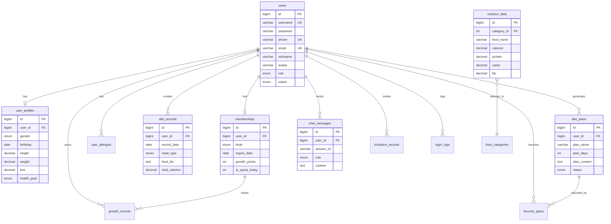

# AI健康饮食规划助手系统 - 数据库设计

**文档版本**: 2.0  
**最后更新**: 2025年12月2日  
**数据库**: MySQL 8.0

---

## 目录
1. [数据库概览](#1-数据库概览)
2. [核心表设计](#2-核心表设计)
3. [ER图](#3-er图)
4. [索引设计](#4-索引设计)
5. [数据字典](#5-数据字典)
6. [SQL脚本](#6-sql脚本)

---

## 1. 数据库概览

### 1.1 数据库命名规范

- **数据库名**: `nutriai`
- **表名**: 小写字母 + 下划线，复数形式（如 `users`, `diet_records`）
- **字段名**: 小写字母 + 下划线（如 `user_id`, `created_at`）
- **索引名**: `idx_表名_字段名`（如 `idx_user_username`）
- **外键名**: `fk_表名_关联表名`（如 `fk_diet_record_user`）

### 1.2 数据表分类

| 模块 | 表名 | 用途 |
|------|------|------|
| **用户模块** | users | 用户基本信息 |
| | user_profiles | 用户健康档案 |
| | user_allergies | 用户过敏源 |
| **认证模块** | login_logs | 登录日志 |
| **会员模块** | memberships | 会员信息 |
| | membership_levels | 会员等级配置 |
| | growth_records | 成长值记录 |
| | invitation_records | 邀请记录 |
| **饮食模块** | diet_records | 饮食记录 |
| | diet_plans | AI生成的饮食计划 |
| | favorite_plans | 收藏的计划 |
| **AI模块** | chat_messages | 聊天消息记录 |
| | ai_call_logs | AI调用日志 |
| **营养数据** | nutrition_data | 营养数据库 |
| | food_categories | 食材分类 |
| **系统模块** | system_configs | 系统配置 |
| | admin_users | 管理员 |

### 1.3 通用字段说明

所有表都包含以下通用字段：
```sql
id BIGINT PRIMARY KEY AUTO_INCREMENT COMMENT '主键ID',
created_at DATETIME NOT NULL DEFAULT CURRENT_TIMESTAMP COMMENT '创建时间',
updated_at DATETIME NOT NULL DEFAULT CURRENT_TIMESTAMP ON UPDATE CURRENT_TIMESTAMP COMMENT '更新时间',
is_deleted TINYINT(1) NOT NULL DEFAULT 0 COMMENT '逻辑删除标记 0-未删除 1-已删除'
```

---

## 2. 核心表设计

### 2.1 用户表 (users)

```sql
CREATE TABLE users (
    id BIGINT PRIMARY KEY AUTO_INCREMENT COMMENT '用户ID',
    username VARCHAR(50) NOT NULL UNIQUE COMMENT '用户名',
    password VARCHAR(255) NOT NULL COMMENT '密码（BCrypt加密）',
    phone VARCHAR(20) UNIQUE COMMENT '手机号',
    email VARCHAR(100) UNIQUE COMMENT '邮箱',
    nickname VARCHAR(50) COMMENT '昵称',
    avatar VARCHAR(255) COMMENT '头像URL',
    role ENUM('user', 'operator', 'admin', 'super_admin') NOT NULL DEFAULT 'user' COMMENT '角色',
    status ENUM('active', 'inactive', 'banned') NOT NULL DEFAULT 'active' COMMENT '账户状态',
    last_login_at DATETIME COMMENT '最后登录时间',
    last_login_ip VARCHAR(50) COMMENT '最后登录IP',
    created_at DATETIME NOT NULL DEFAULT CURRENT_TIMESTAMP,
    updated_at DATETIME NOT NULL DEFAULT CURRENT_TIMESTAMP ON UPDATE CURRENT_TIMESTAMP,
    is_deleted TINYINT(1) NOT NULL DEFAULT 0,
    INDEX idx_username (username),
    INDEX idx_phone (phone),
    INDEX idx_created_at (created_at)
) ENGINE=InnoDB DEFAULT CHARSET=utf8mb4 COLLATE=utf8mb4_unicode_ci COMMENT='用户表';
```

**字段说明**：
- `username`: 4-16位字母数字组合，用于登录
- `password`: BCrypt加密后的密码，长度60字符
- `phone`: 11位中国大陆手机号
- `role`: 用户角色，控制访问权限
- `status`: active-正常，inactive-未激活，banned-封禁

### 2.2 用户健康档案表 (user_profiles)

```sql
CREATE TABLE user_profiles (
    id BIGINT PRIMARY KEY AUTO_INCREMENT,
    user_id BIGINT NOT NULL UNIQUE COMMENT '用户ID',
    gender ENUM('male', 'female', 'other') COMMENT '性别',
    birthday DATE COMMENT '出生日期',
    height DECIMAL(5,2) COMMENT '身高(cm)',
    weight DECIMAL(5,2) COMMENT '体重(kg)',
    bmi DECIMAL(4,2) COMMENT 'BMI指数',
    health_goal ENUM('lose_weight', 'gain_muscle', 'keep_healthy', 'disease_control', 'pregnancy') COMMENT '健康目标',
    daily_budget DECIMAL(10,2) COMMENT '每日饮食预算(元)',
    dietary_preferences TEXT COMMENT '饮食偏好（JSON格式）',
    medical_history TEXT COMMENT '病史记录（加密存储）',
    created_at DATETIME NOT NULL DEFAULT CURRENT_TIMESTAMP,
    updated_at DATETIME NOT NULL DEFAULT CURRENT_TIMESTAMP ON UPDATE CURRENT_TIMESTAMP,
    is_deleted TINYINT(1) NOT NULL DEFAULT 0,
    FOREIGN KEY (user_id) REFERENCES users(id) ON DELETE CASCADE,
    INDEX idx_user_id (user_id)
) ENGINE=InnoDB DEFAULT CHARSET=utf8mb4 COLLATE=utf8mb4_unicode_ci COMMENT='用户健康档案表';
```

**字段说明**：
- `bmi`: 根据身高体重自动计算
- `dietary_preferences`: JSON格式存储，如 `{"vegetarian": true, "spicy": false}`
- `medical_history`: 使用AES-256加密存储敏感健康信息

### 2.3 用户过敏源表 (user_allergies)

```sql
CREATE TABLE user_allergies (
    id BIGINT PRIMARY KEY AUTO_INCREMENT,
    user_id BIGINT NOT NULL COMMENT '用户ID',
    allergy_name VARCHAR(100) NOT NULL COMMENT '过敏源名称',
    severity ENUM('mild', 'moderate', 'severe') NOT NULL DEFAULT 'moderate' COMMENT '严重程度',
    created_at DATETIME NOT NULL DEFAULT CURRENT_TIMESTAMP,
    updated_at DATETIME NOT NULL DEFAULT CURRENT_TIMESTAMP ON UPDATE CURRENT_TIMESTAMP,
    is_deleted TINYINT(1) NOT NULL DEFAULT 0,
    FOREIGN KEY (user_id) REFERENCES users(id) ON DELETE CASCADE,
    INDEX idx_user_id (user_id),
    UNIQUE KEY uk_user_allergy (user_id, allergy_name)
) ENGINE=InnoDB DEFAULT CHARSET=utf8mb4 COLLATE=utf8mb4_unicode_ci COMMENT='用户过敏源表';
```

### 2.4 会员表 (memberships)

```sql
CREATE TABLE memberships (
    id BIGINT PRIMARY KEY AUTO_INCREMENT,
    user_id BIGINT NOT NULL UNIQUE COMMENT '用户ID',
    level ENUM('普通会员', '白银会员', '黄金会员') NOT NULL DEFAULT '普通会员' COMMENT '会员等级',
    expire_date DATE COMMENT '到期日期',
    growth_points INT NOT NULL DEFAULT 0 COMMENT '成长值',
    ai_quota_today INT NOT NULL DEFAULT 3 COMMENT '今日AI咨询剩余次数',
    ai_quota_reset_date DATE COMMENT 'AI配额重置日期',
    total_ai_calls INT NOT NULL DEFAULT 0 COMMENT '累计AI调用次数',
    created_at DATETIME NOT NULL DEFAULT CURRENT_TIMESTAMP,
    updated_at DATETIME NOT NULL DEFAULT CURRENT_TIMESTAMP ON UPDATE CURRENT_TIMESTAMP,
    is_deleted TINYINT(1) NOT NULL DEFAULT 0,
    FOREIGN KEY (user_id) REFERENCES users(id) ON DELETE CASCADE,
    INDEX idx_user_id (user_id),
    INDEX idx_level (level)
) ENGINE=InnoDB DEFAULT CHARSET=utf8mb4 COLLATE=utf8mb4_unicode_ci COMMENT='会员表';
```

**字段说明**：
- `ai_quota_today`: 每日重置，普通会员3次，白银10次，黄金20次
- `growth_points`: 成长值，用于升级会员等级

### 2.5 成长值记录表 (growth_records)

```sql
CREATE TABLE growth_records (
    id BIGINT PRIMARY KEY AUTO_INCREMENT,
    user_id BIGINT NOT NULL COMMENT '用户ID',
    points_change INT NOT NULL COMMENT '成长值变化（正数为增加，负数为减少）',
    action_type VARCHAR(50) NOT NULL COMMENT '行为类型（login, ai_chat, invite等）',
    description VARCHAR(255) COMMENT '描述',
    created_at DATETIME NOT NULL DEFAULT CURRENT_TIMESTAMP,
    FOREIGN KEY (user_id) REFERENCES users(id) ON DELETE CASCADE,
    INDEX idx_user_created (user_id, created_at DESC)
) ENGINE=InnoDB DEFAULT CHARSET=utf8mb4 COLLATE=utf8mb4_unicode_ci COMMENT='成长值记录表';
```

### 2.6 邀请记录表 (invitation_records)

```sql
CREATE TABLE invitation_records (
    id BIGINT PRIMARY KEY AUTO_INCREMENT,
    inviter_id BIGINT NOT NULL COMMENT '邀请人ID',
    invitee_id BIGINT COMMENT '受邀人ID（注册后填充）',
    invite_code VARCHAR(20) NOT NULL UNIQUE COMMENT '邀请码',
    status ENUM('pending', 'registered', 'active') NOT NULL DEFAULT 'pending' COMMENT '状态',
    registered_at DATETIME COMMENT '注册时间',
    activated_at DATETIME COMMENT '激活时间（完成首次AI咨询）',
    reward_points INT COMMENT '奖励成长值',
    created_at DATETIME NOT NULL DEFAULT CURRENT_TIMESTAMP,
    updated_at DATETIME NOT NULL DEFAULT CURRENT_TIMESTAMP ON UPDATE CURRENT_TIMESTAMP,
    FOREIGN KEY (inviter_id) REFERENCES users(id) ON DELETE CASCADE,
    FOREIGN KEY (invitee_id) REFERENCES users(id) ON DELETE SET NULL,
    INDEX idx_inviter (inviter_id),
    INDEX idx_code (invite_code)
) ENGINE=InnoDB DEFAULT CHARSET=utf8mb4 COLLATE=utf8mb4_unicode_ci COMMENT='邀请记录表';
```

### 2.7 饮食记录表 (diet_records)

```sql
CREATE TABLE diet_records (
    id BIGINT PRIMARY KEY AUTO_INCREMENT,
    user_id BIGINT NOT NULL COMMENT '用户ID',
    record_date DATE NOT NULL COMMENT '记录日期',
    meal_type ENUM('breakfast', 'lunch', 'dinner', 'snack') NOT NULL COMMENT '餐次类型',
    food_list TEXT NOT NULL COMMENT '食物列表（JSON格式）',
    total_calories DECIMAL(7,2) COMMENT '总热量(kcal)',
    total_protein DECIMAL(6,2) COMMENT '总蛋白质(g)',
    total_carbs DECIMAL(6,2) COMMENT '总碳水化合物(g)',
    total_fat DECIMAL(6,2) COMMENT '总脂肪(g)',
    image_url VARCHAR(255) COMMENT '食物照片URL',
    notes TEXT COMMENT '备注',
    created_at DATETIME NOT NULL DEFAULT CURRENT_TIMESTAMP,
    updated_at DATETIME NOT NULL DEFAULT CURRENT_TIMESTAMP ON UPDATE CURRENT_TIMESTAMP,
    is_deleted TINYINT(1) NOT NULL DEFAULT 0,
    FOREIGN KEY (user_id) REFERENCES users(id) ON DELETE CASCADE,
    INDEX idx_user_date (user_id, record_date DESC),
    INDEX idx_record_date (record_date)
) ENGINE=InnoDB DEFAULT CHARSET=utf8mb4 COLLATE=utf8mb4_unicode_ci COMMENT='饮食记录表';
```

**food_list JSON格式示例**：
```json
[
  {
    "food_name": "鸡胸肉",
    "weight": 150,
    "calories": 165,
    "protein": 31,
    "carbs": 0,
    "fat": 3.6
  },
  {
    "food_name": "糙米饭",
    "weight": 200,
    "calories": 230,
    "protein": 5,
    "carbs": 50,
    "fat": 2
  }
]
```

### 2.8 AI饮食计划表 (diet_plans)

```sql
CREATE TABLE diet_plans (
    id BIGINT PRIMARY KEY AUTO_INCREMENT,
    user_id BIGINT NOT NULL COMMENT '用户ID',
    plan_name VARCHAR(100) NOT NULL COMMENT '计划名称',
    plan_days INT NOT NULL COMMENT '计划天数',
    plan_content TEXT NOT NULL COMMENT '计划内容（Markdown格式）',
    nutrition_summary TEXT COMMENT '营养摘要（JSON格式）',
    shopping_list TEXT COMMENT '采购清单（JSON格式）',
    estimated_cost DECIMAL(10,2) COMMENT '预估花费(元)',
    status ENUM('draft', 'active', 'completed', 'expired') NOT NULL DEFAULT 'active' COMMENT '状态',
    ai_model VARCHAR(50) COMMENT 'AI模型名称',
    generation_time INT COMMENT '生成耗时(秒)',
    created_at DATETIME NOT NULL DEFAULT CURRENT_TIMESTAMP,
    updated_at DATETIME NOT NULL DEFAULT CURRENT_TIMESTAMP ON UPDATE CURRENT_TIMESTAMP,
    is_deleted TINYINT(1) NOT NULL DEFAULT 0,
    FOREIGN KEY (user_id) REFERENCES users(id) ON DELETE CASCADE,
    INDEX idx_user_created (user_id, created_at DESC),
    INDEX idx_status (status)
) ENGINE=InnoDB DEFAULT CHARSET=utf8mb4 COLLATE=utf8mb4_unicode_ci COMMENT='AI饮食计划表';
```

### 2.9 收藏计划表 (favorite_plans)

```sql
CREATE TABLE favorite_plans (
    id BIGINT PRIMARY KEY AUTO_INCREMENT,
    user_id BIGINT NOT NULL COMMENT '用户ID',
    plan_id BIGINT NOT NULL COMMENT '计划ID',
    tags VARCHAR(255) COMMENT '标签（逗号分隔）',
    notes TEXT COMMENT '备注',
    created_at DATETIME NOT NULL DEFAULT CURRENT_TIMESTAMP,
    FOREIGN KEY (user_id) REFERENCES users(id) ON DELETE CASCADE,
    FOREIGN KEY (plan_id) REFERENCES diet_plans(id) ON DELETE CASCADE,
    UNIQUE KEY uk_user_plan (user_id, plan_id),
    INDEX idx_user_id (user_id)
) ENGINE=InnoDB DEFAULT CHARSET=utf8mb4 COLLATE=utf8mb4_unicode_ci COMMENT='收藏计划表';
```

### 2.10 聊天消息表 (chat_messages)

```sql
CREATE TABLE chat_messages (
    id BIGINT PRIMARY KEY AUTO_INCREMENT,
    user_id BIGINT NOT NULL COMMENT '用户ID',
    session_id VARCHAR(100) NOT NULL COMMENT '会话ID',
    role ENUM('user', 'assistant', 'system') NOT NULL COMMENT '消息角色',
    content TEXT NOT NULL COMMENT '消息内容',
    tokens_used INT COMMENT '消耗的tokens数',
    model_name VARCHAR(50) COMMENT 'AI模型名称',
    response_time INT COMMENT '响应时间(ms)',
    created_at DATETIME NOT NULL DEFAULT CURRENT_TIMESTAMP,
    FOREIGN KEY (user_id) REFERENCES users(id) ON DELETE CASCADE,
    INDEX idx_user_session (user_id, session_id, created_at),
    INDEX idx_created_at (created_at)
) ENGINE=InnoDB DEFAULT CHARSET=utf8mb4 COLLATE=utf8mb4_unicode_ci COMMENT='聊天消息表';
```

### 2.11 AI调用日志表 (ai_call_logs)

```sql
CREATE TABLE ai_call_logs (
    id BIGINT PRIMARY KEY AUTO_INCREMENT,
    user_id BIGINT COMMENT '用户ID（系统调用时为NULL）',
    api_name VARCHAR(100) NOT NULL COMMENT 'API名称（通义千问/图像识别等）',
    request_data TEXT COMMENT '请求数据',
    response_data TEXT COMMENT '响应数据',
    tokens_used INT COMMENT '消耗tokens',
    cost DECIMAL(10,4) COMMENT '成本(元)',
    duration INT COMMENT '耗时(ms)',
    status ENUM('success', 'failed', 'timeout') NOT NULL COMMENT '调用状态',
    error_message TEXT COMMENT '错误信息',
    created_at DATETIME NOT NULL DEFAULT CURRENT_TIMESTAMP,
    FOREIGN KEY (user_id) REFERENCES users(id) ON DELETE SET NULL,
    INDEX idx_user_created (user_id, created_at DESC),
    INDEX idx_api_created (api_name, created_at DESC)
) ENGINE=InnoDB DEFAULT CHARSET=utf8mb4 COLLATE=utf8mb4_unicode_ci COMMENT='AI调用日志表';
```

### 2.12 营养数据表 (nutrition_data)

```sql
CREATE TABLE nutrition_data (
    id BIGINT PRIMARY KEY AUTO_INCREMENT,
    food_name VARCHAR(100) NOT NULL COMMENT '食材名称',
    category_id INT COMMENT '分类ID',
    calories DECIMAL(7,2) NOT NULL COMMENT '热量(kcal/100g)',
    protein DECIMAL(6,2) NOT NULL COMMENT '蛋白质(g/100g)',
    carbs DECIMAL(6,2) NOT NULL COMMENT '碳水化合物(g/100g)',
    fat DECIMAL(6,2) NOT NULL COMMENT '脂肪(g/100g)',
    fiber DECIMAL(5,2) COMMENT '膳食纤维(g/100g)',
    sodium DECIMAL(6,2) COMMENT '钠(mg/100g)',
    vitamin_c DECIMAL(6,2) COMMENT '维生素C(mg/100g)',
    calcium DECIMAL(6,2) COMMENT '钙(mg/100g)',
    iron DECIMAL(5,2) COMMENT '铁(mg/100g)',
    description TEXT COMMENT '描述',
    created_at DATETIME NOT NULL DEFAULT CURRENT_TIMESTAMP,
    updated_at DATETIME NOT NULL DEFAULT CURRENT_TIMESTAMP ON UPDATE CURRENT_TIMESTAMP,
    INDEX idx_food_name (food_name),
    INDEX idx_category (category_id),
    FULLTEXT INDEX idx_food_name_fulltext (food_name)
) ENGINE=InnoDB DEFAULT CHARSET=utf8mb4 COLLATE=utf8mb4_unicode_ci COMMENT='营养数据表';
```

### 2.13 食材分类表 (food_categories)

```sql
CREATE TABLE food_categories (
    id INT PRIMARY KEY AUTO_INCREMENT,
    category_name VARCHAR(50) NOT NULL COMMENT '分类名称',
    parent_id INT COMMENT '父分类ID',
    level INT NOT NULL COMMENT '层级（1/2/3）',
    sort_order INT NOT NULL DEFAULT 0 COMMENT '排序',
    created_at DATETIME NOT NULL DEFAULT CURRENT_TIMESTAMP,
    FOREIGN KEY (parent_id) REFERENCES food_categories(id) ON DELETE CASCADE,
    INDEX idx_parent (parent_id),
    INDEX idx_level (level)
) ENGINE=InnoDB DEFAULT CHARSET=utf8mb4 COLLATE=utf8mb4_unicode_ci COMMENT='食材分类表';
```

**分类示例**：
```
主食类 (level=1)
  ├── 米面类 (level=2)
  │   ├── 白米饭 (level=3)
  │   └── 糙米饭 (level=3)
  └── 面包类 (level=2)
      └── 全麦面包 (level=3)
```

### 2.14 登录日志表 (login_logs)

```sql
CREATE TABLE login_logs (
    id BIGINT PRIMARY KEY AUTO_INCREMENT,
    user_id BIGINT COMMENT '用户ID',
    username VARCHAR(50) NOT NULL COMMENT '用户名',
    login_ip VARCHAR(50) COMMENT '登录IP',
    login_device VARCHAR(255) COMMENT '登录设备',
    login_status ENUM('success', 'failed') NOT NULL COMMENT '登录状态',
    fail_reason VARCHAR(255) COMMENT '失败原因',
    created_at DATETIME NOT NULL DEFAULT CURRENT_TIMESTAMP,
    FOREIGN KEY (user_id) REFERENCES users(id) ON DELETE SET NULL,
    INDEX idx_user_created (user_id, created_at DESC),
    INDEX idx_username_created (username, created_at DESC)
) ENGINE=InnoDB DEFAULT CHARSET=utf8mb4 COLLATE=utf8mb4_unicode_ci COMMENT='登录日志表';
```

### 2.15 系统配置表 (system_configs)

```sql
CREATE TABLE system_configs (
    id INT PRIMARY KEY AUTO_INCREMENT,
    config_key VARCHAR(100) NOT NULL UNIQUE COMMENT '配置键',
    config_value TEXT NOT NULL COMMENT '配置值',
    value_type ENUM('string', 'int', 'boolean', 'json') NOT NULL DEFAULT 'string' COMMENT '值类型',
    description VARCHAR(255) COMMENT '描述',
    is_public TINYINT(1) NOT NULL DEFAULT 0 COMMENT '是否公开（前端可访问）',
    created_at DATETIME NOT NULL DEFAULT CURRENT_TIMESTAMP,
    updated_at DATETIME NOT NULL DEFAULT CURRENT_TIMESTAMP ON UPDATE CURRENT_TIMESTAMP,
    INDEX idx_key (config_key)
) ENGINE=InnoDB DEFAULT CHARSET=utf8mb4 COLLATE=utf8mb4_unicode_ci COMMENT='系统配置表';
```

**配置示例**：
```sql
INSERT INTO system_configs (config_key, config_value, value_type, description, is_public) VALUES
('ai.daily_quota.free', '3', 'int', '免费用户每日AI咨询次数', 0),
('ai.daily_quota.silver', '10', 'int', '白银会员每日AI咨询次数', 0),
('ai.daily_quota.gold', '20', 'int', '黄金会员每日AI咨询次数', 0),
('membership.growth_points.upgrade_silver', '100', 'int', '升级白银会员所需成长值', 1),
('membership.growth_points.upgrade_gold', '300', 'int', '升级黄金会员所需成长值', 1);
```

---

## 3. ER图



---

## 4. 索引设计

### 4.1 索引策略

| 表名 | 索引类型 | 索引字段 | 目的 |
|------|---------|---------|------|
| users | UNIQUE | username | 登录查询 |
| users | UNIQUE | phone | 手机号登录/找回密码 |
| users | INDEX | created_at | 用户增长统计 |
| user_profiles | UNIQUE | user_id | 一对一关联查询 |
| memberships | UNIQUE | user_id | 会员信息查询 |
| diet_records | INDEX | (user_id, record_date DESC) | 用户饮食记录查询 |
| diet_plans | INDEX | (user_id, created_at DESC) | 用户计划列表 |
| chat_messages | INDEX | (user_id, session_id, created_at) | 会话历史查询 |
| ai_call_logs | INDEX | (created_at) | 日志统计查询 |
| nutrition_data | FULLTEXT | food_name | 食材模糊搜索 |

### 4.2 复合索引说明

#### 4.2.1 diet_records表复合索引
```sql
INDEX idx_user_date (user_id, record_date DESC)
```
**用途**: 查询某用户最近的饮食记录
```sql
SELECT * FROM diet_records 
WHERE user_id = 123 
ORDER BY record_date DESC 
LIMIT 7;
```

#### 4.2.2 chat_messages表复合索引
```sql
INDEX idx_user_session (user_id, session_id, created_at)
```
**用途**: 查询某用户某会话的聊天记录
```sql
SELECT * FROM chat_messages 
WHERE user_id = 123 AND session_id = 'session_456'
ORDER BY created_at;
```

---

## 5. 数据字典

### 5.1 枚举值字典

#### 5.1.1 用户角色 (user.role)
| 值 | 说明 | 权限 |
|---|------|------|
| user | 普通用户 | 基础功能访问 |
| operator | 运营人员 | 数据看板、活动管理 |
| admin | 管理员 | 用户管理、内容审核 |
| super_admin | 超级管理员 | 系统全部权限 |

#### 5.1.2 会员等级 (membership.level)
| 值 | AI配额 | 计划天数 | 特殊权益 |
|---|--------|----------|----------|
| 普通会员 | 3次/天 | 3天 | - |
| 白银会员 | 10次/天 | 7天 | 基础营养分析 |
| 黄金会员 | 20次/天 | 30天 | 专业分析+PDF导出 |

#### 5.1.3 健康目标 (user_profile.health_goal)
| 值 | 说明 | AI推荐策略 |
|---|------|-----------|
| lose_weight | 减脂塑形 | 热量缺口300-500kcal |
| gain_muscle | 增肌健身 | 热量盈余200-300kcal + 高蛋白 |
| keep_healthy | 保持健康 | 均衡营养 |
| disease_control | 疾病控制 | 低糖/低盐等特殊饮食 |
| pregnancy | 孕期营养 | 叶酸补充+营养全面 |

---

## 6. SQL脚本

### 6.1 初始化脚本 (V1__init_schema.sql)

```sql
-- 创建数据库
CREATE DATABASE IF NOT EXISTS nutriai 
CHARACTER SET utf8mb4 
COLLATE utf8mb4_unicode_ci;

USE nutriai;

-- 用户表
CREATE TABLE users (
    -- 见前文详细定义
);

-- 用户健康档案表
CREATE TABLE user_profiles (
    -- 见前文详细定义
);

-- 其他表...（见前文）

-- 插入初始管理员
INSERT INTO users (username, password, phone, email, nickname, role, status) 
VALUES (
    'admin', 
    '$2a$10$N.zmdr9k7uOCQb376NoUnuTJ8iAt6Z5EHsM8lE9lBOsl7iKTVKIUi', -- 密码: admin123
    '13800138000',
    'admin@nutriai.com',
    '系统管理员',
    'super_admin',
    'active'
);

-- 插入食材分类
INSERT INTO food_categories (category_name, parent_id, level, sort_order) VALUES
('主食类', NULL, 1, 1),
('蛋白质类', NULL, 1, 2),
('蔬菜类', NULL, 1, 3),
('水果类', NULL, 1, 4);

INSERT INTO food_categories (category_name, parent_id, level, sort_order) VALUES
('米面类', 1, 2, 1),
('面包类', 1, 2, 2),
('肉类', 2, 2, 1),
('海鲜类', 2, 2, 2);

-- 插入营养数据示例
INSERT INTO nutrition_data (food_name, category_id, calories, protein, carbs, fat, fiber, description) VALUES
('鸡胸肉', 7, 110, 23.3, 0, 1.2, 0, '高蛋白低脂肪，健身人士首选'),
('糙米饭', 5, 115, 2.5, 25, 1, 1.8, '富含膳食纤维，GI值低'),
('西兰花', 11, 34, 2.82, 6.64, 0.37, 2.6, '富含维生素C和膳食纤维');
```

### 6.2 数据迁移脚本 (V2__add_ai_tables.sql)

```sql
-- 添加AI相关表

-- 聊天消息表
CREATE TABLE chat_messages (
    -- 见前文详细定义
);

-- AI调用日志表
CREATE TABLE ai_call_logs (
    -- 见前文详细定义
);

-- 为已有用户创建会员记录
INSERT INTO memberships (user_id, level, growth_points, ai_quota_today, ai_quota_reset_date)
SELECT id, '普通会员', 0, 3, CURDATE()
FROM users
WHERE NOT EXISTS (SELECT 1 FROM memberships WHERE user_id = users.id);
```

### 6.3 性能优化脚本

```sql
-- 分析表
ANALYZE TABLE users, diet_records, chat_messages, nutrition_data;

-- 优化表
OPTIMIZE TABLE users, diet_records, chat_messages;

-- 查看索引使用情况
SELECT 
    TABLE_NAME,
    INDEX_NAME,
    SEQ_IN_INDEX,
    COLUMN_NAME,
    CARDINALITY
FROM information_schema.STATISTICS
WHERE TABLE_SCHEMA = 'nutriai'
ORDER BY TABLE_NAME, INDEX_NAME, SEQ_IN_INDEX;

-- 查看慢查询
SELECT * FROM mysql.slow_log ORDER BY query_time DESC LIMIT 10;
```

### 6.4 数据清理脚本

```sql
-- 清理30天前的登录日志
DELETE FROM login_logs WHERE created_at < DATE_SUB(NOW(), INTERVAL 30 DAY);

-- 清理已删除用户的相关数据
DELETE FROM chat_messages WHERE user_id IN (SELECT id FROM users WHERE is_deleted = 1);
DELETE FROM diet_records WHERE user_id IN (SELECT id FROM users WHERE is_deleted = 1);
DELETE FROM diet_plans WHERE user_id IN (SELECT id FROM users WHERE is_deleted = 1);

-- 清理过期的AI调用日志（90天）
DELETE FROM ai_call_logs WHERE created_at < DATE_SUB(NOW(), INTERVAL 90 DAY);
```

---

## 7. 数据库备份策略

### 7.1 备份方案

| 备份类型 | 频率 | 保留时间 | 工具 |
|---------|------|---------|------|
| 全量备份 | 每周日凌晨2点 | 4周 | mysqldump |
| 增量备份 | 每天凌晨3点 | 7天 | binlog |
| 实时复制 | 实时 | - | MySQL主从复制 |

### 7.2 备份脚本

```bash
#!/bin/bash
# 全量备份脚本

BACKUP_DIR="/data/mysql_backup"
DATE=$(date +%Y%m%d_%H%M%S)
DB_NAME="nutriai"
DB_USER="backup_user"
DB_PASS="backup_password"

# 创建备份目录
mkdir -p $BACKUP_DIR

# 执行备份
mysqldump -u$DB_USER -p$DB_PASS \
    --single-transaction \
    --routines \
    --triggers \
    --events \
    --databases $DB_NAME \
    | gzip > $BACKUP_DIR/${DB_NAME}_${DATE}.sql.gz

# 删除30天前的备份
find $BACKUP_DIR -name "${DB_NAME}_*.sql.gz" -mtime +30 -delete

echo "Backup completed: ${DB_NAME}_${DATE}.sql.gz"
```

---

**本文档完整描述了系统的数据库设计，包括15个核心表的详细结构、ER图、索引设计和SQL脚本。开发过程中请严格遵循本设计文档。**
