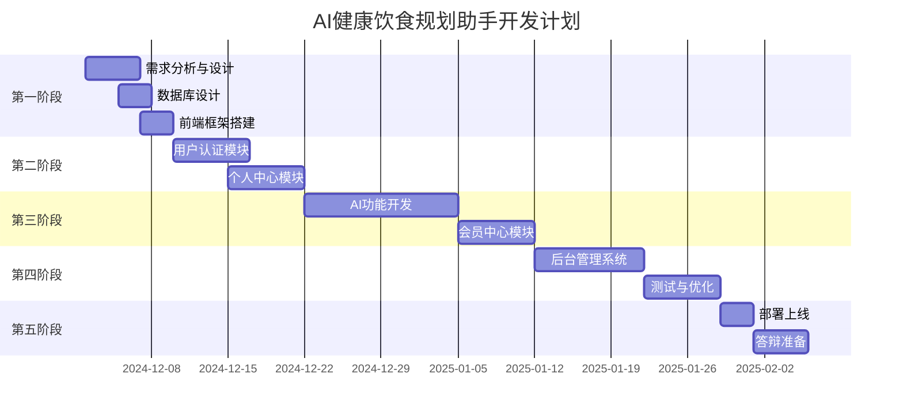

# AI健康饮食规划助手系统 - 项目开发计划

**文档版本**: 2.0  
**最后更新**: 2025年12月2日  
**项目周期**: 12周  
**项目经理**: [待定]

---

## 目录
1. [项目概览](#1-项目概览)
2. [迭代计划](#2-迭代计划)
3. [任务分解](#3-任务分解)
4. [里程碑定义](#4-里程碑定义)
5. [风险管理](#5-风险管理)
6. [质量保证](#6-质量保证)
7. [交付清单](#7-交付清单)

---

## 1. 项目概览

### 1.1 项目时间线



### 1.2 团队分工（1-2人全栈开发）

| 角色 | 职责 | 工作量占比 |
|------|------|-----------|
| 全栈开发 | 前后端开发、数据库设计、系统集成 | 70% |
| UI/UX设计 | 界面设计、交互优化（可兼任） | 10% |
| 测试 | 功能测试、性能测试（可兼任） | 10% |
| 文档编写 | 需求文档、设计报告、接口文档 | 10% |

### 1.3 开发环境

| 工具 | 版本 | 用途 |
|------|------|------|
| Node.js | 18+ | 前端开发 |
| JDK | 17+ | 后端开发 |
| MySQL | 8.0 | 数据库 |
| Redis | 6.0 | 缓存 |
| VS Code | 最新 | 前端IDE |
| IntelliJ IDEA | 2024.3 | 后端IDE |
| Git | 最新 | 版本控制 |
| Postman | 最新 | API测试 |

---

## 2. 迭代计划

### 2.1 第一阶段：需求与设计（第1-2周）

**时间**: 2024-12-02 ~ 2024-12-15  
**目标**: 完成需求分析和系统设计

#### 2.1.1 Sprint 1（第1周）
**任务清单**：
- [x] 需求文档整合（本次任务已完成）
- [x] 系统架构设计
- [x] 数据库设计
- [x] 接口文档编写
- [x] UI/UX设计稿（至少5个核心页面）✅
- [x] 技术选型确认 ✅

**交付物**：
- ✅ 系统需求规格说明书
- ✅ 技术架构设计文档
- ✅ 数据库设计文档
- ✅ 接口文档
- ✅ UI设计规范文档
- ✅ 技术选型确认文档

#### 2.1.2 Sprint 2（第2周）
**任务清单**：
- [x] 前端项目初始化（Vue3 + Vite）✅
- [x] 后端项目初始化（Spring Boot）✅
- [x] 数据库表创建 ✅
- [x] Git仓库创建与配置 ✅
- [x] CI/CD管道搭建 ✅

**交付物**：
- ✅ 可运行的前后端基础框架
- ✅ 前端：20+配置文件，基础路由、状态管理
- ✅ 后端：完整Maven项目，统一响应格式
- ✅ README文档 + 快速启动指南
- ✅ 数据库：**13张表**SQL脚本 + 初始化脚本
- ✅ Git：完整的.gitignore、PR模板、Issue模板
- ✅ CI/CD：**Gitee Go**工作流（前端、后端）+ GitHub Actions备选
- ✅ Docker：docker-compose.yml + Dockerfile

### 2.2 第二阶段：核心模块开发（第3-6周）

**时间**: 2024-12-16 ~ 2025-01-12  
**目标**: 完成用户认证、个人中心、会员中心

#### 2.2.1 Sprint 3（第3周）：用户认证模块
**任务清单**：
- [x] 后端用户认证API ✅
  - [x] 用户注册接口（含表单验证）✅
  - [x] 用户登录接口（含JWT生成）✅
  - [x] 退出登录接口 ✅
  - [x] 密码加密（BCrypt）✅
  - [x] 登录失败计数与图形验证码 ✅
- [x] 前端认证页面 ✅
  - [x] 登录表单组件（Element Plus验证）✅
  - [x] 注册表单组件 ✅
  - [x] 密码强度指示器 ✅
  - [x] 路由守卫配置 ✅
- [x] Pinia认证状态管理 ✅

**验收标准**：
- [x] ✅ 后端编译通过，无错误
- [x] ✅ 前端构建成功，无错误
- [x] ⏸️ 用户可以成功注册（功能正常，需验证码图片识别）
- [x] ⏸️ 用户可以成功登录并获得Token（功能正常，需清除登录失败计数）
- [ ] 未登录用户无法访问受保护页面（需Token测试）
- [x] ✅ 连续3次登录失败后显示验证码（已验证）
- [x] ✅ 所有表单验证正常工作（后端验证正常）

**API测试结果**：详见 `Sprint3-API测试报告.md`  
**错误修复总结**：详见 `Sprint3-错误修复总结.md`

#### 2.2.2 Sprint 4（第4周）：个人中心模块
**任务清单**：
- [x] 后端个人中心API ✅
  - [x] 获取用户资料接口 ✅
  - [x] 更新用户资料接口 ✅
  - [x] 修改密码接口 ✅
  - [x] 修改手机号接口（含短信验证）✅
  - [x] 头像上传接口（OSS）✅
- [x] 前端个人中心页面 ✅
  - [x] 用户资料展示组件 ✅
  - [x] 资料编辑表单 ✅
  - [x] 头像上传组件（拖拽上传）✅
  - [x] 健康档案组件（BMI计算）✅
  - [x] 侧边导航组件 ✅

**验收标准**：
- [x] ✅ 用户可以查看和编辑个人资料
- [x] ✅ BMI自动计算正确
- [x] ✅ 头像上传成功（支持拖拽）
- [x] ⏸️ 修改手机号需要短信验证（需阿里云短信服务配置）

**API测试结果**：详见 `Sprint4-API测试报告.md`  
**开发总结**：
- 后端所有核心API（获取资料、更新资料、修改密码）已完成并测试通过
- 前端个人中心页面完整实现，包含7个组件
- BMI计算器功能完整，包含健康建议和理想体重范围
- 头像上传支持拖拽和点击，带进度显示
- 修改手机号和短信验证接口已实现，待集成测试

#### 2.2.3 Sprint 5（第5周）：饮食记录模块 ✅
**完成时间**: 2025年12月3日

**任务清单**：
- [x] 后端饮食记录API
  - [x] 创建饮食记录接口
  - [x] 查询饮食记录接口（分页）
  - [x] 删除饮食记录接口
  - [x] 营养摄入统计接口
  - [x] 食物照片上传接口
- [x] 前端饮食记录页面
  - [x] 饮食记录列表组件
  - [x] 添加记录表单（三级联动选择器）
  - [x] 食物照片上传（拖拽+预览）
  - [x] 营养摄入图表（ECharts）
  - [x] 日历视图（日期筛选）

**验收标准**：
- [x] 用户可以添加饮食记录
- [x] 可以上传食物照片
- [x] 营养摄入图表正常显示
- [x] 三级联动选择器正常工作
- [x] 日期筛选功能正常
- [x] 删除确认框样式美观
- [x] 消息提示位置正确

**API测试结果**：详见 `Sprint5-API测试报告.md`  
**前端功能说明**：详见 `Sprint5-前端功能说明.md`  
**问题修复记录**：详见 `Sprint5-最终修复说明.md`

**开发总结**：
- ✅ 后端所有饮食记录API（CRUD、统计、照片上传）已完成并测试通过
- ✅ 前端饮食记录页面完整实现，包含6个核心组件
- ✅ ECharts营养统计图表（饼图、柱状图）正常渲染
- ✅ 食物照片上传支持拖拽、预览、验证
- ✅ 餐次类型三级联动选择器实现
- ✅ 日期筛选功能（统计和列表）正常工作
- ✅ 全局消息提示样式统一（fixed定位、渐变背景）
- ✅ 删除确认框样式优化（简洁、居中、美观）
- ✅ 数据库连接问题修复（allowPublicKeyRetrieval）
- ✅ 前端UI/UX优化（响应式布局、动画效果）

**技术亮点**：
- 🎨 使用ECharts实现专业的数据可视化
- 📊 营养成分实时统计和展示
- 🖼️ 图片上传带预览和进度显示
- 🎯 Element Plus组件深度定制
- 💅 统一的消息提示和确认框样式
- 🔄 响应式数据更新机制

#### 2.2.4 Sprint 6（第6周）：会员中心模块
**任务清单**：
- [ ] 后端会员系统API
  - [ ] 获取会员信息接口
  - [ ] 成长值记录接口
  - [ ] 生成邀请链接接口
  - [ ] 查询邀请记录接口
  - [ ] 会员等级升级接口
- [ ] 前端会员中心页面
  - [ ] 会员信息卡片组件
  - [ ] 权益列表组件（虚拟滚动）
  - [ ] 成长值折线图（ECharts）
  - [ ] 邀请面板组件
  - [ ] 等级对比表组件

**验收标准**：
- [ ] 会员信息正确显示
- [ ] 成长值图表正常渲染
- [ ] 邀请链接可以生成和复制
- [ ] 虚拟滚动列表流畅（1000+条目）

### 2.3 第三阶段：AI功能开发（第7-9周）

**时间**: 2025-01-13 ~ 2025-02-02  
**目标**: 完成AI饮食规划核心功能

#### 2.3.1 Sprint 7（第7周）：AI基础框架
**任务清单**：
- [ ] LangChain4j集成
  - [ ] 通义千问API配置
  - [ ] Prompt模板库搭建
  - [ ] 上下文管理器
  - [ ] 工具函数封装
- [ ] 营养数据库导入
  - [ ] 3000+食材数据导入
  - [ ] 食材分类数据
  - [ ] 全文索引创建
- [ ] 前端AI聊天界面
  - [ ] 聊天界面布局
  - [ ] 消息列表组件
  - [ ] 输入区域组件
  - [ ] 快捷操作按钮

**验收标准**：
- [ ] 通义千问API调用成功
- [ ] Prompt模板可以正常渲染
- [ ] 营养数据库可以查询
- [ ] 聊天界面正常显示

#### 2.3.2 Sprint 8（第8周）：AI实时通信
**任务清单**：
- [ ] WebSocket服务端
  - [ ] WebSocket配置
  - [ ] 消息处理器
  - [ ] 会话管理
  - [ ] 流式输出实现
- [ ] WebSocket客户端
  - [ ] WebSocket连接管理
  - [ ] 消息收发
  - [ ] 断线重连
  - [ ] 打字效果实现
- [ ] 聊天功能完善
  - [ ] 历史记录查询
  - [ ] 消息收藏
  - [ ] 复制/导出功能
  - [ ] 文件上传

**验收标准**：
- [ ] WebSocket连接稳定
- [ ] 消息实时推送
- [ ] 打字效果流畅
- [ ] 可以上传TXT/PDF文件

#### 2.3.3 Sprint 9（第9周）：AI高级功能
**任务清单**：
- [ ] AI饮食计划生成
  - [ ] 计划生成算法
  - [ ] 营养数据注入
  - [ ] 采购清单生成
  - [ ] Markdown渲染（前端）
  - [ ] XSS防护（DOMPurify）
- [ ] AI图像识别
  - [ ] 阿里云图像识别API集成
  - [ ] 食物识别接口
  - [ ] 营养数据推算
- [ ] PDF导出（会员功能）
  - [ ] PDF生成（后端）
  - [ ] 下载功能（前端）

**验收标准**：
- [ ] 可以生成7天/30天饮食计划
- [ ] 营养数据准确
- [ ] 可以识别食物照片
- [ ] 黄金会员可以导出PDF

### 2.4 第四阶段：后台管理与优化（第10-11周）

**时间**: 2025-02-03 ~ 2025-02-16  
**目标**: 完成后台管理系统和性能优化

#### 2.4.1 Sprint 10（第10周）：后台管理系统
**任务清单**：
- [ ] 后台管理API
  - [ ] 数据看板接口
  - [ ] 用户管理接口
  - [ ] AI日志查询接口
  - [ ] 系统配置接口
- [ ] 后台管理页面
  - [ ] 管理后台布局
  - [ ] 数据看板（ECharts）
  - [ ] 用户管理表格
  - [ ] AI日志查询
  - [ ] 权限控制（路由守卫）
- [ ] WebSocket实时告警

**验收标准**：
- [ ] 数据看板实时更新
- [ ] 可以管理用户（查看/编辑/禁用）
- [ ] AI日志可以查询和导出
- [ ] 权限控制正常工作

#### 2.4.2 Sprint 11（第11周）：性能优化与测试
**任务清单**：
- [ ] 前端性能优化
  - [ ] 代码分割优化
  - [ ] 图片懒加载
  - [ ] 组件懒加载
  - [ ] 资源压缩（Gzip）
  - [ ] CDN配置
- [ ] 后端性能优化
  - [ ] 数据库索引优化
  - [ ] Redis缓存策略
  - [ ] API限流
  - [ ] 连接池调优
- [ ] 全面测试
  - [ ] 功能测试（所有模块）
  - [ ] 性能测试（JMeter）
  - [ ] 兼容性测试
  - [ ] 安全测试

**验收标准**：
- [ ] 首屏加载 < 1.5秒
- [ ] AI响应 < 3秒
- [ ] 支持1000+并发用户
- [ ] 无严重Bug

### 2.5 第五阶段：部署与答辩（第12周）

**时间**: 2025-02-17 ~ 2025-02-23  
**目标**: 部署上线和答辩准备

#### 2.5.1 Sprint 12（第12周）
**任务清单**：
- [ ] 生产环境部署
  - [ ] 前端打包部署（OSS + CDN）
  - [ ] 后端部署（Docker + ECS）
  - [ ] 数据库配置（RDS）
  - [ ] Redis配置
  - [ ] Nginx配置
  - [ ] HTTPS证书配置
- [ ] 答辩准备
  - [ ] PPT制作
  - [ ] 演示视频录制
  - [ ] 设计报告撰写
  - [ ] 代码注释完善
  - [ ] README文档更新
- [ ] 最终检查
  - [ ] 功能完整性检查
  - [ ] 代码规范检查（ESLint）
  - [ ] 文档完整性检查

**交付物**：
- 完整可运行的系统
- 设计报告
- 答辩PPT
- 演示视频
- 源代码（Git仓库）

---

## 3. 任务分解

### 3.1 WBS（工作分解结构）

```
AI健康饮食规划助手系统
├── 1. 项目管理
│   ├── 1.1 需求分析
│   ├── 1.2 项目计划
│   └── 1.3 风险管理
├── 2. 系统设计
│   ├── 2.1 架构设计
│   ├── 2.2 数据库设计
│   ├── 2.3 接口设计
│   └── 2.4 UI/UX设计
├── 3. 前端开发
│   ├── 3.1 项目初始化
│   ├── 3.2 公共组件开发
│   ├── 3.3 首页模块
│   ├── 3.4 认证模块
│   ├── 3.5 个人中心模块
│   ├── 3.6 会员中心模块
│   ├── 3.7 AI聊天模块
│   └── 3.8 后台管理模块
├── 4. 后端开发
│   ├── 4.1 项目初始化
│   ├── 4.2 认证授权模块
│   ├── 4.3 用户管理模块
│   ├── 4.4 AI服务模块
│   ├── 4.5 会员系统模块
│   ├── 4.6 饮食记录模块
│   ├── 4.7 后台管理模块
│   └── 4.8 WebSocket服务
├── 5. 数据库
│   ├── 5.1 表结构设计
│   ├── 5.2 初始化脚本
│   ├── 5.3 索引优化
│   └── 5.4 数据导入
├── 6. 测试
│   ├── 6.1 单元测试
│   ├── 6.2 集成测试
│   ├── 6.3 性能测试
│   └── 6.4 安全测试
├── 7. 部署
│   ├── 7.1 环境配置
│   ├── 7.2 前端部署
│   ├── 7.3 后端部署
│   └── 7.4 数据库迁移
└── 8. 文档
    ├── 8.1 需求文档
    ├── 8.2 设计文档
    ├── 8.3 接口文档
    ├── 8.4 设计报告
    └── 8.5 用户手册
```

### 3.2 详细任务清单（Checklist）

#### 3.2.1 前端开发任务
- [ ] **项目初始化**
  - [ ] 使用Vite创建Vue3项目
  - [ ] 安装依赖（Pinia、Vue Router、Element Plus等）
  - [ ] 配置ESLint和Prettier
  - [ ] 配置TailwindCSS
  - [ ] 配置路径别名(@指向src)
  
- [ ] **公共组件**
  - [ ] BaseButton组件
  - [ ] NutritionCard组件
  - [ ] LoadingSpinner组件
  - [ ] EmptyState组件
  - [ ] ThemeSwitcher组件
  
- [ ] **首页模块**
  - [ ] HeaderNav组件（滚动样式变化）
  - [ ] BannerSlider组件（自动播放+手动切换）
  - [ ] FeatureCards组件（功能入口）
  - [ ] FooterInfo组件（懒加载）
  
- [ ] **认证模块**
  - [ ] LoginForm组件（VeeValidate验证）
  - [ ] RegisterForm组件
  - [ ] CaptchaInput组件
  - [ ] 路由守卫配置
  
- [ ] **个人中心模块**
  - [ ] UserSidebar组件
  - [ ] HealthProfile组件（BMI计算）
  - [ ] DietRecords组件
  - [ ] FoodImageUpload组件（拖拽上传）
  - [ ] FavoritePlans组件
  - [ ] HealthReports组件（ECharts）
  
- [ ] **会员中心模块**
  - [ ] MembershipCard组件
  - [ ] PrivilegeList组件（虚拟滚动）
  - [ ] GrowthChart组件（ECharts）
  - [ ] InvitationPanel组件
  
- [ ] **AI聊天模块**
  - [ ] ChatInterface组件
  - [ ] MessageList组件
  - [ ] InputArea组件
  - [ ] HistoryPanel组件
  - [ ] WebSocket连接管理
  - [ ] Markdown渲染（marked + DOMPurify）
  
- [ ] **后台管理模块**
  - [ ] AdminLayout布局
  - [ ] Dashboard组件（ECharts）
  - [ ] UserManagement组件
  - [ ] AILogs组件
  - [ ] SystemConfig组件

#### 3.2.2 后端开发任务
- [ ] **项目初始化**
  - [ ] 创建Spring Boot项目
  - [ ] 配置数据库连接
  - [ ] 配置Redis连接
  - [ ] 配置JWT
  - [ ] 配置Swagger
  
- [ ] **认证授权模块**
  - [ ] 用户注册接口
  - [ ] 用户登录接口
  - [ ] JWT Token生成与验证
  - [ ] 密码加密（BCrypt）
  - [ ] 登录失败计数
  
- [ ] **用户管理模块**
  - [ ] 获取用户信息接口
  - [ ] 更新用户资料接口
  - [ ] 修改密码接口
  - [ ] 修改手机号接口
  - [ ] 头像上传接口（OSS）
  
- [ ] **AI服务模块**
  - [ ] LangChain4j集成
  - [ ] 通义千问API调用
  - [ ] Prompt模板管理
  - [ ] 饮食计划生成接口
  - [ ] 食物识别接口
  - [ ] WebSocket消息处理
  - [ ] 上下文管理
  
- [ ] **会员系统模块**
  - [ ] 获取会员信息接口
  - [ ] 成长值记录接口
  - [ ] 邀请链接生成接口
  - [ ] 会员等级升级接口
  
- [ ] **饮食记录模块**
  - [ ] 创建饮食记录接口
  - [ ] 查询饮食记录接口
  - [ ] 删除饮食记录接口
  - [ ] 营养摄入统计接口
  
- [ ] **后台管理模块**
  - [ ] 数据看板接口
  - [ ] 用户管理接口
  - [ ] AI日志查询接口
  - [ ] 系统配置接口

---

## 4. 里程碑定义

### 4.1 关键里程碑

| 里程碑 | 时间 | 标准 | 验收人 |
|-------|------|------|-------|
| **M1: 项目启动** | 第1周末 | 需求文档、设计文档完成 | 项目组 |
| **M2: 框架搭建** | 第2周末 | 前后端框架可运行，数据库创建 | 技术负责人 |
| **M3: 认证完成** | 第3周末 | 用户可以注册登录，路由守卫工作 | 开发者 |
| **M4: 核心模块** | 第6周末 | 个人中心、会员中心完成 | 项目组 |
| **M5: AI功能** | 第9周末 | AI饮食计划生成功能完成 | 项目组 |
| **M6: 系统完成** | 第11周末 | 所有功能开发完成，测试通过 | 测试人员 |
| **M7: 上线答辩** | 第12周末 | 系统部署上线，答辩完成 | 评审组 |

### 4.2 每周检查点

**周一**：制定本周任务清单  
**周三**：中期检查，调整计划  
**周五**：周总结，代码Review

---

## 5. 风险管理

### 5.1 风险识别与应对

| 风险类型 | 概率 | 影响 | 应对策略 |
|---------|------|------|---------|
| **通义千问API限额** | 中 | 高 | 提前申请免费额度，开发阶段使用缓存，准备降级方案 |
| **前后端集成问题** | 高 | 中 | 提前定义接口规范，使用Mock数据并行开发 |
| **性能不达标** | 中 | 高 | 提前性能测试，预留优化时间，使用缓存和CDN |
| **时间延期** | 中 | 高 | 采用敏捷开发，每周评估进度，及时调整计划 |
| **技术难点** | 中 | 中 | 提前技术预研，WebSocket、虚拟滚动等提前验证 |
| **数据安全** | 低 | 高 | 敏感数据加密，HTTPS部署，定期安全扫描 |
| **第三方服务故障** | 低 | 中 | 服务降级方案，错误提示优化，重试机制 |

### 5.2 风险监控

**每周风险评审**：
1. 识别新风险
2. 评估现有风险状态
3. 执行应对措施
4. 更新风险登记册

---

## 6. 质量保证

### 6.1 代码质量

#### 6.1.1 代码规范
- **前端**：遵循ESLint + Vue官方风格指南
- **后端**：遵循阿里巴巴Java开发手册
- **提交规范**：遵循Conventional Commits

#### 6.1.2 Code Review
- **频率**：每周五下午
- **参与人**：全体开发人员
- **关注点**：
  - 代码可读性
  - 性能问题
  - 安全漏洞
  - 最佳实践

#### 6.1.3 测试覆盖率
- **单元测试**：核心业务逻辑覆盖率 > 70%
- **集成测试**：关键API接口100%覆盖
- **E2E测试**：核心用户流程覆盖

### 6.2 测试策略

| 测试类型 | 工具 | 覆盖范围 | 执行时机 |
|---------|------|---------|---------|
| 单元测试 | Vitest (前端), JUnit (后端) | 工具函数、业务逻辑 | 开发过程中 |
| 集成测试 | Postman, RestAssured | API接口 | 每个Sprint结束 |
| E2E测试 | Playwright | 核心用户流程 | 集成测试后 |
| 性能测试 | JMeter | 并发、响应时间 | 第11周 |
| 安全测试 | OWASP ZAP | SQL注入、XSS等 | 第11周 |

### 6.3 Bug管理

**Bug优先级**：
- **P0 - 致命**：系统崩溃、数据丢失 → 立即修复
- **P1 - 严重**：核心功能不可用 → 24小时内修复
- **P2 - 一般**：次要功能异常 → 本周内修复
- **P3 - 轻微**：UI瑕疵、提示文案 → 下个Sprint修复

---

## 7. 交付清单

### 7.1 代码交付

- [ ] **前端代码**
  - [ ] Vue3项目源码
  - [ ] 构建后的dist目录
  - [ ] package.json依赖清单
  - [ ] .env环境变量示例
  
- [ ] **后端代码**
  - [ ] Spring Boot项目源码
  - [ ] JAR包（可执行）
  - [ ] pom.xml依赖清单
  - [ ] application.yml配置示例
  
- [ ] **数据库脚本**
  - [ ] 初始化脚本（V1__init_schema.sql）
  - [ ] 迁移脚本（V2__add_ai_tables.sql）
  - [ ] 示例数据脚本（demo_data.sql）

### 7.2 文档交付

- [x] **01-系统概述与目标.md**
- [x] **02-功能需求详述.md**
- [x] **02-功能需求详述-AI与后台.md**
- [x] **03-前端开发规范.md**
- [x] **04-技术架构设计.md**
- [x] **05-数据库设计.md**
- [x] **06-接口文档.md**
- [x] **07-项目开发计划.md**（本文档）
- [ ] **设计报告.pdf**（答辩用）
- [ ] **用户使用手册.pdf**
- [ ] **部署运维手册.md**

### 7.3 答辩材料

- [ ] **答辩PPT**（20-30页）
  - [ ] 项目背景与目标
  - [ ] 技术架构介绍
  - [ ] 核心功能演示
  - [ ] 技术亮点展示
  - [ ] 开发过程总结
  - [ ] 未来规划
  
- [ ] **演示视频**（5-10分钟）
  - [ ] 系统概览
  - [ ] 核心功能演示
  - [ ] 技术亮点展示
  
- [ ] **设计报告**（30-50页）
  - [ ] 需求分析
  - [ ] 系统设计
  - [ ] 功能实现
  - [ ] 测试与优化
  - [ ] 总结反思

### 7.4 部署材料

- [ ] **Docker镜像**
  - [ ] 前端Nginx镜像
  - [ ] 后端SpringBoot镜像
  - [ ] MySQL镜像
  - [ ] Redis镜像
  
- [ ] **配置文件**
  - [ ] docker-compose.yml
  - [ ] nginx.conf
  - [ ] .env环境变量
  
- [ ] **部署文档**
  - [ ] 本地开发环境搭建
  - [ ] 生产环境部署步骤
  - [ ] 常见问题FAQ

---

## 8. 项目总结

### 8.1 成功标准

项目成功的定义：
1. ✅ 所有核心功能正常工作
2. ✅ 符合《前端开发技术》考核标准（90分以上）
3. ✅ 性能指标达标（首屏<1.5s，AI响应<3s）
4. ✅ 无高危安全漏洞
5. ✅ 答辩顺利通过

### 8.2 后续改进方向

**短期优化**（1-2个月）：
- 增加更多AI功能（如食谱推荐、运动建议）
- 优化AI响应速度
- 增加社区功能（用户分享食谱）
- 增加移动端原生APP

**长期规划**（6-12个月）：
- 接入更多AI模型（对比推荐）
- 增加在线支付功能
- 增加线下营养师预约
- 增加食材电商功能
- 多语言国际化

---

**本开发计划提供了完整的12周开发路线图，包括详细的任务分解、里程碑定义、风险管理和质量保证措施。请严格按照本计划执行，确保项目按时高质量交付。**
