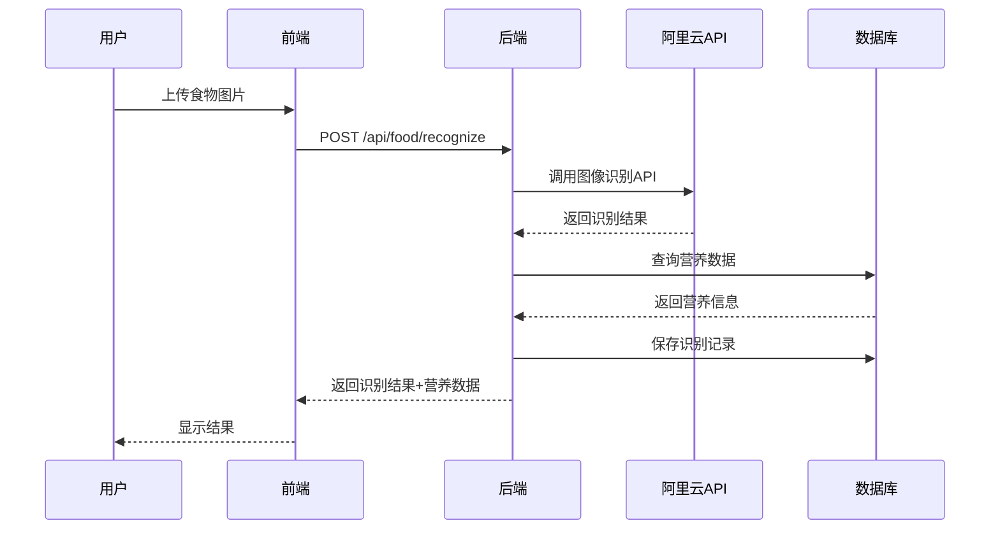
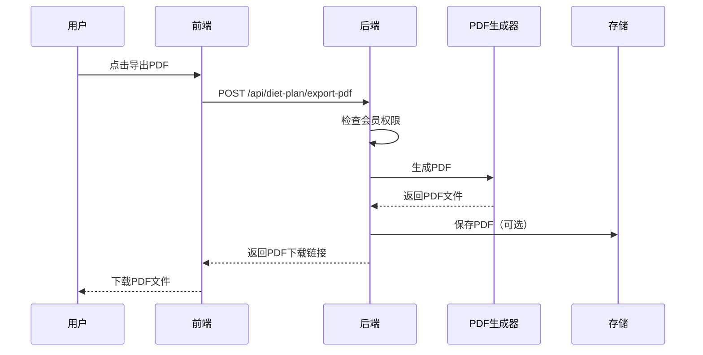

# Sprint 9 - AI图像识别与PDF导出功能设计文档

## 📋 目录
1. [功能概述](#功能概述)
2. [AI图像识别](#ai图像识别)
3. [PDF导出](#pdf导出)
4. [技术架构](#技术架构)
5. [API设计](#api设计)
6. [数据库设计](#数据库设计)
7. [实现计划](#实现计划)

---

## 功能概述

### 1. AI图像识别
用户上传食物图片，系统自动识别食物类型并推算营养数据。

**核心功能**：
- 图片上传
- 食物识别（使用阿里云视觉智能API）
- 营养数据推算
- 识别历史记录

### 2. PDF导出（会员功能）
黄金会员可以将饮食计划导出为精美的PDF文档。

**核心功能**：
- 饮食计划PDF生成
- 营养报告PDF生成
- 自定义封面和样式
- 下载和预览

---

## AI图像识别

### 2.1 功能流程



### 2.2 阿里云API选择

**推荐使用**：阿里云视觉智能开放平台 - 图像识别

**API端点**：
```
https://imagerecog.cn-shanghai.aliyuncs.com/
```

**功能**：
- 通用图像识别
- 食物识别
- 场景识别

**定价**：
- 免费额度：500次/月
- 超出部分：0.001元/次

### 2.3 后端实现

#### 2.3.1 依赖添加

```xml
<!-- pom.xml -->
<dependency>
    <groupId>com.aliyun</groupId>
    <artifactId>imagerecog20190930</artifactId>
    <version>2.0.1</version>
</dependency>
```

#### 2.3.2 配置类

```java
@Configuration
public class AliyunConfig {
    @Value("${aliyun.access-key-id}")
    private String accessKeyId;
    
    @Value("${aliyun.access-key-secret}")
    private String accessKeySecret;
    
    @Bean
    public Client imageRecogClient() throws Exception {
        Config config = new Config()
            .setAccessKeyId(accessKeyId)
            .setAccessKeySecret(accessKeySecret)
            .setEndpoint("imagerecog.cn-shanghai.aliyuncs.com");
        return new Client(config);
    }
}
```

#### 2.3.3 Service层

```java
@Service
public class FoodRecognitionService {
    
    @Autowired
    private Client imageRecogClient;
    
    @Autowired
    private FoodNutritionRepository foodNutritionRepository;
    
    /**
     * 识别食物图片
     */
    public FoodRecognitionResult recognizeFood(MultipartFile image) {
        // 1. 上传图片到OSS或转为Base64
        String imageUrl = uploadToOSS(image);
        
        // 2. 调用阿里云API识别
        RecognizeFoodRequest request = new RecognizeFoodRequest()
            .setImageURL(imageUrl);
        RecognizeFoodResponse response = imageRecogClient.recognizeFood(request);
        
        // 3. 解析识别结果
        List<FoodItem> foods = parseResponse(response);
        
        // 4. 查询营养数据
        for (FoodItem food : foods) {
            FoodNutrition nutrition = foodNutritionRepository
                .findByFoodNameContaining(food.getName())
                .orElse(estimateNutrition(food));
            food.setNutrition(nutrition);
        }
        
        // 5. 保存识别记录
        saveRecognitionHistory(foods);
        
        return new FoodRecognitionResult(foods);
    }
}
```

#### 2.3.4 Controller层

```java
@RestController
@RequestMapping("/food")
public class FoodRecognitionController {
    
    @Autowired
    private FoodRecognitionService recognitionService;
    
    /**
     * 识别食物图片
     */
    @PostMapping("/recognize")
    public ResponseEntity<ApiResponse<FoodRecognitionResult>> recognizeFood(
            @RequestParam("image") MultipartFile image,
            @RequestHeader("Authorization") String authHeader) {
        
        // 验证文件
        if (image.isEmpty()) {
            return ResponseEntity.badRequest()
                .body(ApiResponse.error(400, "图片不能为空"));
        }
        
        // 验证文件类型
        String contentType = image.getContentType();
        if (!contentType.startsWith("image/")) {
            return ResponseEntity.badRequest()
                .body(ApiResponse.error(400, "只支持图片格式"));
        }
        
        // 验证文件大小（最大5MB）
        if (image.getSize() > 5 * 1024 * 1024) {
            return ResponseEntity.badRequest()
                .body(ApiResponse.error(400, "图片大小不能超过5MB"));
        }
        
        try {
            FoodRecognitionResult result = recognitionService.recognizeFood(image);
            return ResponseEntity.ok(ApiResponse.success("识别成功", result));
        } catch (Exception e) {
            log.error("食物识别失败", e);
            return ResponseEntity.status(500)
                .body(ApiResponse.error(500, "识别失败: " + e.getMessage()));
        }
    }
    
    /**
     * 获取识别历史
     */
    @GetMapping("/recognition-history")
    public ResponseEntity<ApiResponse<List<RecognitionHistory>>> getHistory(
            @RequestHeader("Authorization") String authHeader) {
        
        String token = authHeader.replace("Bearer ", "");
        Long userId = jwtUtil.getUserIdFromToken(token);
        
        List<RecognitionHistory> history = recognitionService.getHistory(userId);
        return ResponseEntity.ok(ApiResponse.success(history));
    }
}
```

### 2.4 前端实现

#### 2.4.1 图片上传组件

```vue
<template>
  <div class="food-recognition">
    <el-card>
      <template #header>
        <h3>🍎 AI食物识别</h3>
      </template>
      
      <!-- 上传区域 -->
      <el-upload
        class="upload-demo"
        drag
        :auto-upload="false"
        :on-change="handleImageChange"
        :show-file-list="false"
        accept="image/*"
      >
        <el-icon class="el-icon--upload"><upload-filled /></el-icon>
        <div class="el-upload__text">
          拖拽图片到此处或 <em>点击上传</em>
        </div>
        <template #tip>
          <div class="el-upload__tip">
            支持 jpg/png 格式，大小不超过 5MB
          </div>
        </template>
      </el-upload>
      
      <!-- 预览图片 -->
      <div v-if="previewUrl" class="preview-section">
        
        <el-button type="primary" @click="recognizeFood" :loading="isRecognizing">
          开始识别
        </el-button>
      </div>
      
      <!-- 识别结果 -->
      <div v-if="recognitionResult" class="result-section">
        <h4>识别结果</h4>
        <el-table :data="recognitionResult.foods" style="width: 100%">
          <el-table-column prop="name" label="食物名称" />
          <el-table-column prop="confidence" label="置信度">
            <template #default="{ row }">
              {{ (row.confidence * 100).toFixed(1) }}%
            </template>
          </el-table-column>
          <el-table-column prop="nutrition.energy" label="热量(kcal)" />
          <el-table-column prop="nutrition.protein" label="蛋白质(g)" />
          <el-table-column prop="nutrition.carbohydrate" label="碳水(g)" />
          <el-table-column prop="nutrition.fat" label="脂肪(g)" />
        </el-table>
      </div>
    </el-card>
  </div>
</template>

<script setup>
import { ref } from 'vue'
import { ElMessage } from 'element-plus'
import { UploadFilled } from '@element-plus/icons-vue'

const previewUrl = ref(null)
const selectedFile = ref(null)
const isRecognizing = ref(false)
const recognitionResult = ref(null)

const handleImageChange = (file) => {
  selectedFile.value = file.raw
  previewUrl.value = URL.createObjectURL(file.raw)
}

const recognizeFood = async () => {
  if (!selectedFile.value) {
    ElMessage.warning('请先选择图片')
    return
  }
  
  isRecognizing.value = true
  
  try {
    const formData = new FormData()
    formData.append('image', selectedFile.value)
    
    const token = localStorage.getItem('token')
    const response = await fetch('http://localhost:8080/api/food/recognize', {
      method: 'POST',
      headers: {
        'Authorization': `Bearer ${token}`
      },
      body: formData
    })
    
    const data = await response.json()
    
    if (data.code === 200) {
      recognitionResult.value = data.data
      ElMessage.success('识别成功！')
    } else {
      throw new Error(data.message)
    }
  } catch (error) {
    console.error('识别失败:', error)
    ElMessage.error('识别失败: ' + error.message)
  } finally {
    isRecognizing.value = false
  }
}
</script>
```

### 2.5 营养数据推算

当数据库中没有精确匹配的食物时，使用AI推算营养数据：

```java
private FoodNutrition estimateNutrition(FoodItem food) {
    // 使用通义千问AI推算营养数据
    String prompt = String.format(
        "请估算以下食物的营养成分（每100g）：%s\n" +
        "请以JSON格式返回：{\"energy\": 热量(kcal), \"protein\": 蛋白质(g), " +
        "\"carbohydrate\": 碳水化合物(g), \"fat\": 脂肪(g)}",
        food.getName()
    );
    
    String response = chatLanguageModel.generate(prompt);
    return parseNutritionFromJson(response);
}
```

---

## PDF导出

### 3.1 功能流程



### 3.2 后端实现

#### 3.2.1 依赖添加

```xml
<!-- pom.xml -->
<!-- iText PDF生成 -->
<dependency>
    <groupId>com.itextpdf</groupId>
    <artifactId>itext7-core</artifactId>
    <version>7.2.5</version>
    <type>pom</type>
</dependency>

<!-- 中文字体支持 -->
<dependency>
    <groupId>com.itextpdf</groupId>
    <artifactId>font-asian</artifactId>
    <version>7.2.5</version>
</dependency>
```

#### 3.2.2 PDF生成Service

```java
@Service
public class PdfExportService {
    
    /**
     * 导出饮食计划为PDF
     */
    public byte[] exportDietPlanToPdf(DietPlanResponse plan) throws IOException {
        ByteArrayOutputStream baos = new ByteArrayOutputStream();
        PdfWriter writer = new PdfWriter(baos);
        PdfDocument pdf = new PdfDocument(writer);
        Document document = new Document(pdf, PageSize.A4);
        
        // 设置中文字体
        PdfFont font = PdfFontFactory.createFont("STSong-Light", "UniGB-UCS2-H");
        document.setFont(font);
        
        // 添加标题
        Paragraph title = new Paragraph(plan.getTitle())
            .setFontSize(24)
            .setBold()
            .setTextAlignment(TextAlignment.CENTER);
        document.add(title);
        
        // 添加副标题
        Paragraph subtitle = new Paragraph(plan.getGoalDescription())
            .setFontSize(14)
            .setTextAlignment(TextAlignment.CENTER)
            .setMarginBottom(20);
        document.add(subtitle);
        
        // 解析Markdown并添加内容
        String[] sections = plan.getMarkdownContent().split("\n## ");
        for (String section : sections) {
            if (section.trim().isEmpty()) continue;
            
            String[] lines = section.split("\n", 2);
            String sectionTitle = lines[0].replace("#", "").trim();
            String sectionContent = lines.length > 1 ? lines[1] : "";
            
            // 添加章节标题
            Paragraph sectionHeader = new Paragraph(sectionTitle)
                .setFontSize(18)
                .setBold()
                .setMarginTop(15);
            document.add(sectionHeader);
            
            // 添加章节内容
            addMarkdownContent(document, sectionContent, font);
        }
        
        // 添加页脚
        addFooter(pdf, font);
        
        document.close();
        return baos.toByteArray();
    }
    
    private void addMarkdownContent(Document document, String content, PdfFont font) {
        // 简单的Markdown解析
        String[] lines = content.split("\n");
        for (String line : lines) {
            if (line.startsWith("### ")) {
                // 三级标题
                Paragraph p = new Paragraph(line.replace("### ", ""))
                    .setFontSize(14)
                    .setBold();
                document.add(p);
            } else if (line.startsWith("- ")) {
                // 列表项
                Paragraph p = new Paragraph("  • " + line.substring(2))
                    .setFontSize(12);
                document.add(p);
            } else if (!line.trim().isEmpty()) {
                // 普通文本
                Paragraph p = new Paragraph(line)
                    .setFontSize(12);
                document.add(p);
            }
        }
    }
    
    private void addFooter(PdfDocument pdf, PdfFont font) {
        int numberOfPages = pdf.getNumberOfPages();
        for (int i = 1; i <= numberOfPages; i++) {
            PdfPage page = pdf.getPage(i);
            Rectangle pageSize = page.getPageSize();
            
            Canvas canvas = new Canvas(page, pageSize);
            canvas.setFont(font);
            canvas.setFontSize(10);
            
            Paragraph footer = new Paragraph(
                String.format("第 %d 页 / 共 %d 页 | AI健康饮食规划助手", i, numberOfPages)
            ).setTextAlignment(TextAlignment.CENTER);
            
            canvas.showTextAligned(footer,
                pageSize.getWidth() / 2,
                20,
                TextAlignment.CENTER);
            
            canvas.close();
        }
    }
}
```

#### 3.2.3 Controller层

```java
@RestController
@RequestMapping("/diet-plan")
public class DietPlanController {
    
    @Autowired
    private PdfExportService pdfExportService;
    
    @Autowired
    private MembershipService membershipService;
    
    /**
     * 导出饮食计划为PDF（会员功能）
     */
    @GetMapping("/export-pdf/{planId}")
    public ResponseEntity<byte[]> exportPdf(
            @PathVariable String planId,
            @RequestHeader("Authorization") String authHeader) {
        
        try {
            // 验证用户身份
            String token = authHeader.replace("Bearer ", "");
            Long userId = jwtUtil.getUserIdFromToken(token);
            
            // 检查会员权限
            if (!membershipService.isGoldMember(userId)) {
                return ResponseEntity.status(403)
                    .body("此功能仅限黄金会员使用".getBytes());
            }
            
            // 获取饮食计划
            DietPlanResponse plan = dietPlanService.getPlanById(planId);
            if (plan == null) {
                return ResponseEntity.notFound().build();
            }
            
            // 生成PDF
            byte[] pdfBytes = pdfExportService.exportDietPlanToPdf(plan);
            
            // 设置响应头
            HttpHeaders headers = new HttpHeaders();
            headers.setContentType(MediaType.APPLICATION_PDF);
            headers.setContentDisposition(
                ContentDisposition.attachment()
                    .filename(plan.getTitle() + ".pdf", StandardCharsets.UTF_8)
                    .build()
            );
            
            return ResponseEntity.ok()
                .headers(headers)
                .body(pdfBytes);
                
        } catch (Exception e) {
            log.error("PDF导出失败", e);
            return ResponseEntity.status(500)
                .body(("导出失败: " + e.getMessage()).getBytes());
        }
    }
}
```

### 3.3 前端实现

```vue
<!-- 在DietPlanView.vue中添加 -->
<template>
  <div class="result-actions">
    <el-button @click="handleExportPdf" :loading="isExporting">
      <el-icon><Download /></el-icon>
      导出PDF
    </el-button>
  </div>
</template>

<script setup>
const isExporting = ref(false)

const handleExportPdf = async () => {
  if (!generatedPlan.value) {
    ElMessage.warning('请先生成饮食计划')
    return
  }
  
  isExporting.value = true
  
  try {
    const token = localStorage.getItem('token')
    const response = await fetch(
      `http://localhost:8080/api/diet-plan/export-pdf/${generatedPlan.value.planId}`,
      {
        method: 'GET',
        headers: {
          'Authorization': `Bearer ${token}`
        }
      }
    )
    
    if (response.status === 403) {
      ElMessage.warning('此功能仅限黄金会员使用')
      return
    }
    
    if (!response.ok) {
      throw new Error('导出失败')
    }
    
    // 下载PDF
    const blob = await response.blob()
    const url = URL.createObjectURL(blob)
    const a = document.createElement('a')
    a.href = url
    a.download = `${generatedPlan.value.title}.pdf`
    document.body.appendChild(a)
    a.click()
    document.body.removeChild(a)
    URL.revokeObjectURL(url)
    
    ElMessage.success('PDF导出成功！')
  } catch (error) {
    console.error('导出失败:', error)
    ElMessage.error('导出失败: ' + error.message)
  } finally {
    isExporting.value = false
  }
}
</script>
```

---

## 数据库设计

### 4.1 食物识别历史表

```sql
CREATE TABLE food_recognition_history (
    id BIGINT PRIMARY KEY AUTO_INCREMENT,
    user_id BIGINT NOT NULL COMMENT '用户ID',
    image_url VARCHAR(500) COMMENT '图片URL',
    recognition_result JSON COMMENT '识别结果（JSON格式）',
    created_at TIMESTAMP DEFAULT CURRENT_TIMESTAMP,
    INDEX idx_user_id (user_id),
    INDEX idx_created_at (created_at)
) COMMENT='食物识别历史记录';
```

### 4.2 PDF导出记录表

```sql
CREATE TABLE pdf_export_history (
    id BIGINT PRIMARY KEY AUTO_INCREMENT,
    user_id BIGINT NOT NULL COMMENT '用户ID',
    plan_id VARCHAR(100) COMMENT '计划ID',
    file_name VARCHAR(255) COMMENT '文件名',
    file_size BIGINT COMMENT '文件大小（字节）',
    download_count INT DEFAULT 0 COMMENT '下载次数',
    created_at TIMESTAMP DEFAULT CURRENT_TIMESTAMP,
    INDEX idx_user_id (user_id),
    INDEX idx_plan_id (plan_id)
) COMMENT='PDF导出历史记录';
```

---

## 实现计划

### 阶段1: AI图像识别（预计2天）
- [ ] Day 1: 后端实现
  - [ ] 添加依赖
  - [ ] 配置阿里云API
  - [ ] 实现Service层
  - [ ] 实现Controller层
  - [ ] 单元测试
- [ ] Day 2: 前端实现
  - [ ] 创建图片上传组件
  - [ ] 实现识别功能
  - [ ] 显示识别结果
  - [ ] 集成测试

### 阶段2: PDF导出（预计1.5天）
- [ ] Day 3: 后端实现
  - [ ] 添加iText依赖
  - [ ] 实现PDF生成Service
  - [ ] 实现Controller层
  - [ ] 测试PDF生成
- [ ] Day 4: 前端实现
  - [ ] 添加导出按钮
  - [ ] 实现下载功能
  - [ ] 会员权限提示
  - [ ] 集成测试

### 阶段3: 测试和文档（预计0.5天）
- [ ] 功能测试
- [ ] 性能测试
- [ ] 编写使用文档
- [ ] 更新API文档

---

## 验收标准

### AI图像识别
- [ ] 可以上传图片（jpg/png，最大5MB）
- [ ] 识别准确率 > 80%
- [ ] 能够返回营养数据
- [ ] 保存识别历史
- [ ] 响应时间 < 3秒

### PDF导出
- [ ] 黄金会员可以导出PDF
- [ ] PDF格式正确，支持中文
- [ ] 包含完整的饮食计划内容
- [ ] 样式美观，排版合理
- [ ] 文件大小合理（< 2MB）

---

**文档版本**: 1.0  
**创建时间**: 2025-12-04 19:15  
**状态**: 设计完成，待实现
