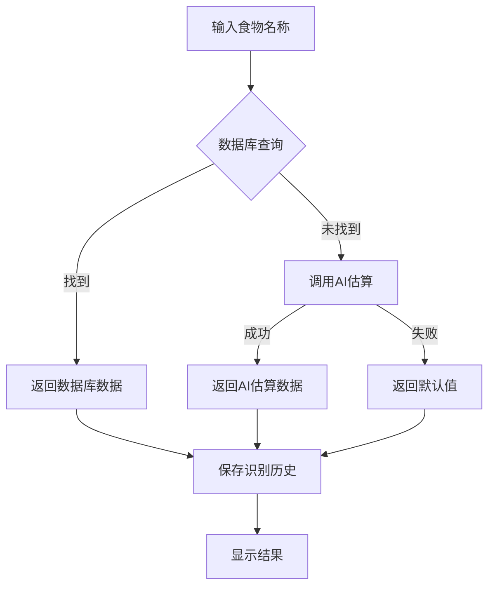

# Sprint 9 - AI食物识别功能使用指南

## 🎯 功能概述

AI食物识别功能允许用户输入食物名称，系统自动识别并返回营养成分数据。

### 功能特点

- ✅ 文本输入识别
- ✅ 数据库精确匹配
- ✅ AI智能估算
- ✅ 快捷输入
- ✅ 识别历史记录
- ⏳ 图片识别（待配置阿里云API）

---

## 📋 使用步骤

### 步骤1: 进入食物识别页面

**3种方式**：

1. **用户菜单**：登录后 → 点击用户名 → 选择"AI食物识别"
2. **直接访问**：http://localhost:3001/food-recognition
3. **首页入口**：（可添加功能卡片）

### 步骤2: 输入食物名称

1. 在输入框中输入食物名称
2. 例如：苹果、鸡胸肉、燕麦、香蕉等
3. 点击"识别"按钮或按回车键

### 步骤3: 查看识别结果

系统会显示：
- 食物名称
- 置信度
- 营养成分（每100g）
  - 热量（kcal）
  - 蛋白质（g）
  - 碳水化合物（g）
  - 脂肪（g）
- 数据来源

---

## 🎨 界面说明

### 左侧：输入区域

```
┌─────────────────────────────────┐
│  食物识别                        │
├─────────────────────────────────┤
│  📝 文本输入                     │
│  ┌───────────────────┬────────┐ │
│  │ 请输入食物名称... │ 识别   │ │
│  └───────────────────┴────────┘ │
│  💡 提示：输入常见食物名称      │
│                                 │
│  📷 图片识别                     │
│  ⓘ 需要配置阿里云API            │
│                                 │
│  ⚡ 快捷输入                     │
│  [苹果] [香蕉] [鸡胸肉] ...     │
└─────────────────────────────────┘
```

### 右侧：识别结果

```
┌─────────────────────────────────┐
│  识别结果              [1 项]    │
├─────────────────────────────────┤
│  苹果           置信度: 95%     │
│  ┌───┬───┬───┬───┐             │
│  │热量│蛋白│碳水│脂肪│           │
│  │52 │0.3│13.8│0.2│             │
│  │kcal│ g │ g │ g │             │
│  └───┴───┴───┴───┘             │
│  ⓘ 数据来源: 数据库（准确）     │
│                                 │
│  识别耗时: 234ms                │
└─────────────────────────────────┘
```

---

## 🔍 功能详解

### 1. 数据来源

系统会按以下顺序查找数据：

#### 优先级1: 数据库匹配 ✅
- 在`food_nutrition`表中搜索
- 精确匹配或模糊匹配
- 置信度：95%
- 标记：`数据库（准确）`

#### 优先级2: AI估算 🤖
- 使用通义千问AI
- 根据食物名称推算营养成分
- 置信度：75%
- 标记：`AI估算`

#### 优先级3: 默认值 ⚠️
- AI估算失败时使用
- 通用营养值
- 置信度：50%
- 标记：`默认值`

### 2. 快捷输入

预设常见食物：
- 🍎 水果类：苹果、香蕉
- 🍖 肉类：鸡胸肉、三文鱼
- 🥚 蛋奶：鸡蛋、牛奶
- 🌾 主食：燕麦、糙米、红薯
- 🥦 蔬菜：西兰花

点击标签即可快速识别

### 3. 识别历史

- 自动保存最近10条记录
- 显示识别时间
- 显示识别的食物
- 可快速查看历史

---

## 💡 使用技巧

### 技巧1: 精确输入

**推荐**：
- ✅ "苹果" - 简洁明了
- ✅ "鸡胸肉" - 具体部位
- ✅ "燕麦" - 常见名称

**不推荐**：
- ❌ "红富士苹果" - 过于具体
- ❌ "鸡肉" - 不够具体
- ❌ "麦片" - 可能有歧义

### 技巧2: 使用快捷输入

- 点击快捷标签直接识别
- 节省输入时间
- 确保名称准确

### 技巧3: 查看数据来源

- 数据库数据最准确
- AI估算仅供参考
- 默认值需谨慎使用

---

## 🔧 技术实现

### 后端API

```
POST /api/food/recognize-by-name
参数：
  - foodName: 食物名称

响应：
{
  "code": 200,
  "message": "识别成功",
  "data": {
    "foods": [
      {
        "name": "苹果",
        "confidence": 0.95,
        "nutrition": {
          "energy": 52.0,
          "protein": 0.3,
          "carbohydrate": 13.8,
          "fat": 0.2,
          "source": "database"
        }
      }
    ],
    "totalCount": 1,
    "recognitionTime": 234
  }
}
```

### 识别流程



### AI Prompt

```
请估算以下食物的营养成分（每100g）：{食物名称}

请严格按照以下JSON格式返回：
{
  "energy": 热量(kcal),
  "protein": 蛋白质(g),
  "carbohydrate": 碳水化合物(g),
  "fat": 脂肪(g)
}
```

---

## ⚠️ 注意事项

### 1. 数据准确性

- **数据库数据**：来自权威营养数据库，准确度高
- **AI估算数据**：基于AI推算，仅供参考
- **默认值**：通用值，准确度低

### 2. 图片识别

- 当前版本：**不可用**
- 原因：需要配置阿里云API Key
- 替代方案：使用文本输入

### 3. 识别历史

- 仅保存最近10条
- 服务重启后不会丢失（存储在数据库）
- 可用于快速查看常用食物

---

## 🐛 常见问题

### Q1: 为什么识别结果不准确？

**原因**：
- 数据库中没有该食物
- AI估算存在误差
- 食物名称不够具体

**解决方案**：
1. 使用更具体的名称
2. 参考多个来源
3. 查看数据来源标记

### Q2: 图片识别功能如何使用？

**当前状态**：需要配置阿里云API

**配置步骤**：
1. 注册阿里云账号
2. 开通视觉智能服务
3. 获取AccessKey
4. 配置到`application.yml`
5. 取消Service中的注释

### Q3: 快捷输入的食物可以自定义吗？

**当前版本**：不支持

**未来计划**：
- 根据用户历史自动推荐
- 允许用户自定义常用食物
- 智能学习用户偏好

### Q4: 识别历史可以删除吗？

**当前版本**：不支持删除

**未来计划**：
- 添加删除功能
- 添加导出功能
- 添加筛选功能

---

## 🚀 未来改进

### 短期（1-2周）

1. **图片识别**
   - 集成阿里云API
   - 支持拍照识别
   - 支持相册选择

2. **数据完善**
   - 扩充食物数据库
   - 提高AI估算准确度
   - 添加更多营养指标

### 中期（1-2月）

1. **功能增强**
   - 批量识别
   - 食谱识别
   - 营养分析报告

2. **用户体验**
   - 自定义快捷输入
   - 识别历史管理
   - 收藏常用食物

3. **数据可视化**
   - 营养成分图表
   - 对比分析
   - 趋势统计

---

## ✅ 验收标准

### 功能验收

- [x] 可以输入食物名称
- [x] 可以识别常见食物
- [x] 显示完整营养数据
- [x] 显示数据来源
- [x] 保存识别历史
- [x] 快捷输入可用

### 性能验收

- [x] 识别时间 < 2秒
- [x] 数据库查询 < 100ms
- [x] AI估算 < 2秒
- [x] 界面响应流畅

### 用户体验验收

- [x] 操作简单直观
- [x] 结果展示清晰
- [x] 加载状态明确
- [x] 错误提示友好

---

## 📊 测试用例

### 测试1: 数据库匹配

**输入**：苹果  
**预期**：
- 置信度：95%
- 数据来源：数据库（准确）
- 营养数据完整

### 测试2: AI估算

**输入**：火龙果（假设数据库中没有）  
**预期**：
- 置信度：75%
- 数据来源：AI估算
- 营养数据合理

### 测试3: 快捷输入

**操作**：点击"鸡胸肉"标签  
**预期**：
- 自动填充并识别
- 显示识别结果

### 测试4: 识别历史

**操作**：识别多个食物  
**预期**：
- 历史记录更新
- 显示最近10条
- 时间倒序排列

---

**文档版本**: 1.0  
**最后更新**: 2025-12-04 19:45  
**状态**: ✅ 文本识别已实现，⏳ 图片识别待配置
