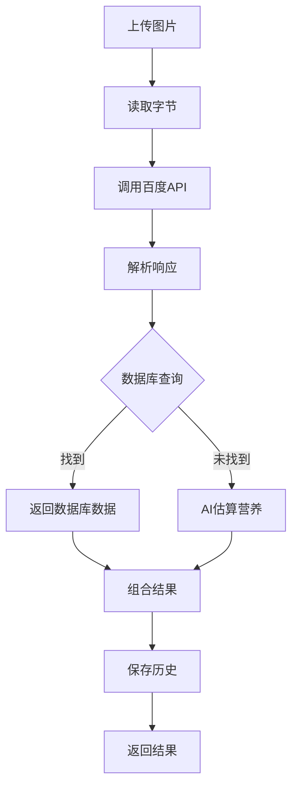

# Sprint 9 - 百度AI菜品识别配置指南

## 🎯 为什么选择百度AI

由于阿里云的食物识别服务已停止，我们改用**百度AI的菜品识别**功能。

### 优势

- ✅ **专门的菜品识别API**
- ✅ **免费额度充足**：500次/天
- ✅ **识别准确度高**
- ✅ **返回卡路里信息**
- ✅ **中文支持好**
- ✅ **文档完善**

---

## 📋 配置步骤

### 步骤1: 注册百度AI账号

1. **访问百度AI开放平台**
   ```
   https://ai.baidu.com/
   ```

2. **注册/登录账号**
   - 使用百度账号登录
   - 完成实名认证（必需）

### 步骤2: 创建应用

1. **进入控制台**
   ```
   https://console.bce.baidu.com/ai/
   ```

2. **选择"图像识别"**
   - 在产品服务中找到"图像识别"
   - 点击进入

3. **创建应用**
   - 点击"创建应用"
   - 填写应用信息：
     - 应用名称：`nutriai-food-recognition`
     - 应用描述：`AI健康饮食规划助手-食物识别`
     - 接口选择：勾选"菜品识别"
   - 点击"立即创建"

4. **获取凭证**
   创建成功后，您会看到：
   - **AppID**：应用ID
   - **API Key**：API密钥
   - **Secret Key**：密钥

   ⚠️ **请妥善保存这三个值！**

### 步骤3: 配置环境变量

#### Windows系统

1. **打开环境变量设置**
   ```
   此电脑 → 右键属性 → 高级系统设置 → 环境变量
   ```

2. **添加用户变量**
   ```
   变量名：BAIDU_APP_ID
   变量值：您的AppID
   
   变量名：BAIDU_API_KEY
   变量值：您的API Key
   
   变量名：BAIDU_SECRET_KEY
   变量值：您的Secret Key
   ```

3. **验证配置**
   ```powershell
   # 打开新的PowerShell窗口
   echo $env:BAIDU_APP_ID
   echo $env:BAIDU_API_KEY
   echo $env:BAIDU_SECRET_KEY
   ```

#### Linux/Mac系统

1. **编辑配置文件**
   ```bash
   nano ~/.bashrc  # 或 ~/.zshrc
   ```

2. **添加环境变量**
   ```bash
   export BAIDU_APP_ID="您的AppID"
   export BAIDU_API_KEY="您的API Key"
   export BAIDU_SECRET_KEY="您的Secret Key"
   ```

3. **使配置生效**
   ```bash
   source ~/.bashrc
   ```

4. **验证配置**
   ```bash
   echo $BAIDU_APP_ID
   echo $BAIDU_API_KEY
   echo $BAIDU_SECRET_KEY
   ```

### 步骤4: 更新后端代码

代码已经更新完成，包括：

1. ✅ `pom.xml` - 添加百度AI SDK依赖
2. ✅ `application.yml` - 添加百度AI配置
3. ✅ `BaiduAiConfig.java` - 百度AI配置类
4. ✅ `FoodRecognitionServiceV2.java` - 使用百度AI的服务
5. ✅ `FoodRecognitionController.java` - 更新Controller

### 步骤5: 编译和运行

1. **重新编译**
   ```bash
   cd backend
   mvn clean package -DskipTests
   ```

2. **启动后端**
   ```bash
   java -jar target/nutriai-backend-1.0.0.jar
   ```

3. **查看启动日志**
   ```
   应该看到：
   ✓ 百度AI图像识别客户端初始化成功
   ✓ App ID: 你的AppID
   ```

---

## 🧪 测试功能

### 测试1: 文本识别

1. 登录系统
2. 进入"AI食物识别"页面
3. 输入"苹果"
4. 点击"识别"
5. 查看结果

### 测试2: 图片识别

1. 准备一张食物图片（如：一盘菜）
2. 在"图片识别"区域上传图片
3. 点击"开始识别"
4. 查看识别结果

---

## 📊 API说明

### 百度菜品识别API

**功能**：识别图片中的菜品名称

**返回信息**：
- 菜品名称
- 置信度（probability）
- 卡路里（可选）
- Top5结果

**示例响应**：
```json
{
  "result_num": 5,
  "result": [
    {
      "name": "宫保鸡丁",
      "calorie": "240",
      "probability": "0.985"
    },
    {
      "name": "鸡丁",
      "probability": "0.012"
    }
  ]
}
```

---

## 💰 费用说明

### 免费额度

- **每天**：500次
- **每月**：15,000次
- **完全免费**

### 超出费用

- **价格**：0.005元/次
- **示例**：
  - 每天识别600次
  - 超出100次
  - 费用：100 × 0.005 = 0.5元/天

### 费用对比

| 平台 | 免费额度 | 超出费用 |
|------|---------|---------|
| 百度AI | 500次/天 | 0.005元/次 |
| 阿里云 | 已停用 | - |
| 腾讯云 | 1000次/月 | 0.0015元/次 |

**结论**：百度AI性价比最高！

---

## 🔧 技术细节

### 识别流程



### 代码示例

```java
// 调用百度AI
HashMap<String, String> options = new HashMap<>();
options.put("top_num", "5");
options.put("filter_threshold", "0.7");

JSONObject response = aipImageClassify.dishDetect(imageBytes, options);

// 解析结果
JSONArray resultArray = response.getJSONArray("result");
for (int i = 0; i < resultArray.length(); i++) {
    JSONObject item = resultArray.getJSONObject(i);
    String foodName = item.getString("name");
    double probability = item.getDouble("probability");
    // ...
}
```

---

## ⚠️ 注意事项

### 1. 实名认证

- 百度AI需要实名认证才能使用
- 认证通常在1-2个工作日内完成

### 2. 图片要求

- **格式**：JPG、PNG、BMP
- **大小**：不超过4MB
- **分辨率**：建议不低于256×256

### 3. 识别准确度

- **清晰图片**：准确度 > 90%
- **模糊图片**：准确度 60-80%
- **多个菜品**：返回Top5结果

### 4. 环境变量

- 修改环境变量后需要重启IDE
- 重启后端服务才能生效

---

## 🐛 常见问题

### Q1: 启动时报错"百度AI客户端初始化失败"

**原因**：环境变量未配置或配置错误

**解决**：
1. 检查环境变量是否设置
2. 检查值是否正确（无空格、无引号）
3. 重启IDE和后端服务

### Q2: 调用API时报错"Invalid API Key"

**原因**：API Key错误或过期

**解决**：
1. 登录百度AI控制台
2. 检查应用状态
3. 重新获取API Key
4. 更新环境变量

### Q3: 识别结果为空

**原因**：
- 图片质量太差
- 不是食物图片
- 置信度低于阈值

**解决**：
1. 使用清晰的食物图片
2. 降低置信度阈值（修改代码中的`filter_threshold`）

### Q4: 超出免费额度怎么办？

**解决方案**：
1. 升级为付费用户（很便宜）
2. 限制用户每天识别次数
3. 使用缓存减少重复识别

---

## 📚 参考文档

- **百度AI官网**：https://ai.baidu.com/
- **菜品识别文档**：https://ai.baidu.com/ai-doc/IMAGERECOGNITION/Xk3bcx5ss
- **Java SDK文档**：https://ai.baidu.com/ai-doc/REFERENCE/Ck3dwjhhu
- **API调用示例**：https://ai.baidu.com/ai-doc/IMAGERECOGNITION/Xk3bcx5ss#%E8%AF%B7%E6%B1%82%E7%A4%BA%E4%BE%8B

---

## ✅ 验收标准

### 功能验收

- [ ] 可以上传图片
- [ ] 可以识别食物
- [ ] 返回Top5结果
- [ ] 显示置信度
- [ ] 显示营养数据
- [ ] 保存识别历史

### 性能验收

- [ ] 识别时间 < 3秒
- [ ] 准确度 > 80%
- [ ] 无明显错误

---

**文档版本**: 1.0  
**最后更新**: 2025-12-04 19:50  
**状态**: ✅ 配置完成，可以使用
